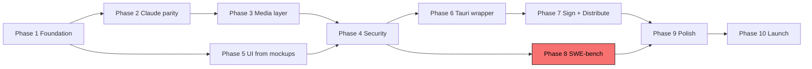

# Forge — Master Delivery Plan to Shipped Desktop App (v0.1.0)

> **Status**: locked 2026-05-01. Supersedes scope from
> [GAP_ANALYSIS.md](GAP_ANALYSIS.md) and [SPRINT_6_PLAN.md](SPRINT_6_PLAN.md);
> those remain valid for their narrow domains. **This is the master plan.**
>
> **Scope shift from previous plans**: prior planning targeted "v0.1.0 as
> a CLI + dashboard." User now wants **a deployable desktop app** built
> from the [mockups/](../mockups/) — a real installable artifact distributed
> via Homebrew + GitHub Releases with auto-update + code signing. This
> doc scopes the full path from current state (~669 tests, 50+ commits,
> Sprint 6.0 complete) to a tagged v0.1.0 release that an end-user can
> double-click on macOS / Linux / Windows.

---

## TL;DR

- **Stack**: Tauri v2 desktop wrapper around the Next.js UI + Python sidecar daemon. Goose's exact playbook (Goose migrated from Electron to Tauri v2 in 2026; their Discussion #7332 is the postmortem). 5 MB binary, signed updater built in. Python daemon is unchanged.
- **Timeline**: ~16 weeks of focused single-developer work to shipping v0.1.0.
- **Phases**: 10 phases × ~1.5 weeks each. Each ends with an acceptance gate.
- **Hard kill**: ADR-015 — if SWE-bench Verified <30% on 50-task subset at week 11, we pivot or shut down before launch effort.
- **External costs**: ~$700 one-time (Apple Developer ID $99 + Windows EV cert $300–500 + landing-page domain $30 + demo hosting), plus optional pen-test ($5k–15k).
- **Maintenance budget post-launch**: ~10 hr/week sustainable cadence (issue triage, security advisories, dependency bumps).

---

## Part 1 — Vision

### What "deployable" means concretely

An end-user on a fresh Mac / Linux box / WSL2 should be able to:

1. Visit `forge.dev/download` (or `brew install forge`)
2. Get a signed, notarized installer for their OS
3. Open the app — see the welcome / wizard from `mockups/04-wizard.html`
4. Click through to the empty-state from `mockups/02-empty-state.html`
5. Type their first prompt and watch it execute in `mockups/01-main-chat.html`
6. Approve at the merge gate (`mockups/03-merge-gate.html`)
7. Receive a native auto-update notification when v0.1.1 ships

No Python installation visible to the user. No `pip install` step. No `localhost:3000` browser tab. No "open the dashboard in your browser." The app runs as a real native desktop app with a dock icon, menu bar, and OS-native window chrome.

The terminal CLI (`forge plan "..."`, `forge serve --headless`) remains available for power users and CI but is **not** the primary surface for v0.1.0 launch.

### Target users

- Solo devs and small teams running M-series Mac with 24 GB+ RAM (primary)
- Developers who already use Claude Code and want a "Claude Code + persistent brain + open-weight fallback"
- Privacy-conscious developers in regulated industries (local-first, zero telemetry)
- Power users wanting MCP-bidirectional coding agent

### Non-goals for v0.1.0

- ❌ Multi-tenant deployment (Forge is local-first, ADR-007)
- ❌ Native Windows (WSL2 supported, native Win32 deferred to v0.2)
- ❌ Mobile (iOS/Android out of scope)
- ❌ Real-time collaboration / shared sessions
- ❌ Plugin marketplace (registry deferred to v0.2)
- ❌ Cloud-hosted Forge tier
- ❌ Telemetry of any kind

### Hard kill criterion

ADR-015: if Forge can't reach **≥30% on a 50-task SWE-bench Verified subset** using the open-weight stack (`gpt-oss:20b` planner + `qwen3-coder-next` generator + cross-family eval) by Phase 8 (week 11), the open-weight thesis fails. Pivot options: (a) Claude-API-only mode with subscription tier, (b) narrow vertical (e.g., "Forge for Supabase + Vercel projects"), (c) shutdown.

---

## Part 2 — Architecture

### Recommended stack

```
┌─ desktop wrapper ──────────────────────────────────┐
│  Tauri v2 (Rust)                                   │
│  • Window/menu/dock icon                           │
│  • Native auto-update (signed manifest)            │
│  • OS keychain access for OAuth tokens             │
│  • Native notifications (osascript / notify-send)  │
│  • DMG / MSI / .deb / .rpm bundlers                │
│  • Sidecar process management (spawns daemon)      │
│                                                    │
│  ┌─ embedded webview ─────────────────────────────┐ │
│  │  Next.js UI (already exists at ui/)           │ │
│  │  React + Tailwind + WebSocket client           │ │
│  │  Components from the 5 mockups                 │ │
│  └────────────────────────────────────────────────┘ │
│                                                    │
│  ┌─ sidecar process ──────────────────────────────┐ │
│  │  Forge daemon (Python 3.12+, asyncio)         │ │
│  │  • WS server bound 127.0.0.1:9111             │ │
│  │  • SQLite KB at .forge/forge.db               │ │
│  │  • Plugin runtime (subprocess + sandbox)      │ │
│  │  • Bundled via PyInstaller or uv-managed venv │ │
│  └────────────────────────────────────────────────┘ │
└────────────────────────────────────────────────────┘
```

### Why Tauri v2 (not Electron)

| Dimension | Tauri v2 | Electron |
|---|---|---|
| Bundle size | ~5 MB | ~150 MB |
| Memory baseline | ~80 MB | ~250 MB |
| Auto-update | Built-in signed manifest | Squirrel.Mac/Win (mature but heavier) |
| OS native widgets | First-class via `@tauri-apps/api` | Polyfills via webview |
| Code-signing flow | Tauri CLI handles macOS notarization | Manual electron-builder config |
| 2026 industry direction | Goose migrated TO Tauri (Discussion #7332) | Goose migrated AWAY from Electron |
| Rust ecosystem | First-class (uses `tao`, `wry`) | N/A |
| WebView2 / WebKit footprint | Uses OS webview | Bundles Chromium |

### Why Python sidecar (not Rust rewrite)

- Forge's current 8,279-line Python daemon ships features in days, not weeks
- Forge's differentiator (planner/evaluator/KB) lives in Python — rewriting in Rust is 2–4 months of risk for marginal distribution gains
- Tauri v2 has first-class sidecar API (`tauri::api::process::Command`)
- PyInstaller produces self-contained binaries (~30 MB extra in the bundle); user never sees Python
- Daemon stays portable — same code runs in CLI, Tauri sidecar, and Docker

### Decision matrix vs alternatives

| Option | Effort | Code reuse | Risk | Verdict |
|---|---|---|---|---|
| **Tauri v2 + Python sidecar** | 2 wks | 95% | Low | **CHOSEN** |
| Electron + Python sidecar | 1.5 wks | 95% | Medium (industry direction is wrong way) | ✗ |
| Full Rust rewrite | 12 wks | 0% | High | ✗ defer to v0.2 if needed |
| Textual TUI only | 2 wks | 100% | Low | ✗ user wants desktop app |
| Python-only PyInstaller bundle | 1 wk | 100% | Medium (no native chrome) | ✗ |

---

## Part 3 — Phased timeline

```
Week 1-2    Phase 1: Foundation completion (Sprint 6.1–6.4)
Week 3-5    Phase 2: Claude Code parity (Sprint 7)
Week 6-8    Phase 3: Media layer (Sprint 8)
Week 9      Phase 4: Security hardening (Sprint 9)
Week 10-12  Phase 5: UI implementation from mockups
Week 13     Phase 6: Tauri v2 desktop wrapper
Week 14     Phase 7: Code signing + distribution
Week 15     Phase 8: SWE-bench evaluation (HARD KILL GATE)
Week 16     Phase 9: Pre-launch polish + docs
            Phase 10: Launch + ongoing
```

---

## Phase 1 — Foundation completion (weeks 1-2)

The plumbing the mockups depend on. Already scoped in
[SPRINT_6_PLAN.md](SPRINT_6_PLAN.md) §6.1–6.4. Summary:

| Sprint | Days | Acceptance |
|---|---|---|
| 6.1 Plugin runtime | 5 | A tampered plugin file refuses to run with `SkillTampered`; a plugin trying to fetch a non-allowlisted URL raises `CapabilityViolation`; audit log records every invocation |
| 6.2 Mode picker enforcement | 2 | In `plan` mode generator never produces a diff; in `ask` mode every write triggers a user-prompt event; in `bypass` mode rm-rf runs without prompt and audit log records it |
| 6.3 Slash-command handlers | 2 | Every command in the palette has a daemon-side handler emitting a structured response |
| 6.4 Reference connectors | 3 | 4 production connectors: GitHub-via-MCP, Vercel-via-MCP, Postgres-via-MCP, SendGrid-native |

**Deliverable**: every WS event the mockups consume has a real daemon implementation.

**Acceptance gate**: launch the dashboard, run a session end-to-end, every mockup feature has a real wiring (no placeholder data).

---

## Phase 2 — Claude Code parity (weeks 3-5)

[SPRINT_6_PLAN.md](SPRINT_6_PLAN.md) §7. The 10 features from the
2026-05-01 research sweep:

1. Hooks system — `.forge/hooks.toml` with PreToolUse/PostToolUse/PreCompact/SubagentStop/SessionStart
2. Subagents — `.forge/agents/*.md` Markdown + YAML frontmatter
3. Custom slash commands — `.forge/commands/*.md` (Claude-Code-compatible)
4. AGENTS.md ingestion (root-to-leaf walk)
5. Memory tool — Anthropic-compatible `view/create/str_replace/insert/delete/rename` over `.forge/memories/`
6. Output styles — `.forge/output-styles/*.md`
7. Sandbox profiles — `sandbox-exec` macOS / `bwrap` Linux / Win restricted token
8. `apply_patch` adapter (Codex V4A diff format)
9. Background / scheduled sprints + native notifications
10. Per-mode prompt overlays + refusal templates

**Acceptance gate**: a Claude Code user can drop existing `.claude/agents/*.md`, `.claude/commands/*.md`, and `CLAUDE.md` into a Forge project unchanged and they all work. Sandbox profiles enforce at OS level.

---

## Phase 3 — Media layer (weeks 6-8)

[SPRINT_6_PLAN.md](SPRINT_6_PLAN.md) §8. Image / video / multimodal.

3 reference media providers:
- `forge-media-comfyui` — local-first, Apple Silicon MPS (zero cost)
- `forge-media-replicate` — Flux Schnell ($0.003/img), Flux Pro ($0.05/img), Veo 3.1 Lite ($0.15/s)
- `forge-media-openai-image` — gpt-image-1 family

`MediaProvider` plugin contract; asset storage at `.forge/media/<sprint-id>/`; `BudgetController` extension with per-image / per-second pricing; multimodal input pipeline (vision-LM passthrough + Mistral OCR ladder); NSFW post-filter + C2PA / SynthID provenance verification.

**Acceptance gate**: `forge plan "make a hero image and embed in the landing page"` runs end-to-end on a free Ollama-only setup using local ComfyUI; same prompt with `REPLICATE_API_TOKEN` set flips $ tier to metered and runs Flux Schnell.

---

## Phase 4 — Security hardening (week 9)

15 layers from [SECURITY_AUDIT.md](SECURITY_AUDIT.md). Not all at once
— prioritized by attack-class severity. Order:

| L# | Layer | Days |
|---|---|---|
| L1 | Provenance-tagged context (`trust: system\|user\|repo\|web\|mcp\|kb`) | 1 |
| L3 | Lethal-trifecta scheduler wiring (function exists, needs hookup) | 0.5 |
| L4 | Egress allow-list in worktree sandbox | 1 |
| L5 | Unicode + bidi-override sanitizer (Pillar Security defense) | 0.5 |
| L7 | Confirm-token binding for destructive ops | 0.5 |
| L8 | Per-project Anthropic prompt-cache key isolation | 0.25 |
| L10 | WebSocket Origin header check + CSRF token | 0.25 |
| L11 | Strict CSP + no remote images in UI markdown | 0.25 |
| L13 | Pre-egress secret redaction at model-API boundary | 0.5 |
| L14 | Compaction guardrails (re-inject system policy) | 0.25 |
| L15 | Append-only tool-call audit log | 0.5 |
| L2,L6,L9,L12 | Already covered by Sprint 6.1 + 7 | 0 |

**Acceptance gate**: every attack class from SECURITY_AUDIT.md has a working defense; integration test suite for sandbox escapes (path traversal, fork bomb, env-var exfil) passes.

---

## Phase 5 — UI implementation from mockups (weeks 10-12)

The five mockups become real React components. Per-mockup breakdown:

### Screen 01 — main chat in-session

| Component | New / existing | WS events consumed | Effort |
|---|---|---|---|
| `<Sidebar />` | new | `project_context`, `session_list` | 1d |
| `<ProjectFolders />` | new | `project_list` | 0.5d |
| `<SessionList />` | new | `session_list`, `session_complete` | 0.5d |
| `<TopBar />` | exists (extend) | `project_context.billing_tier`, `model_changed`, `context_used` | 0.5d |
| `<ChatThread />` | new | `plan_created`, all `sprint.*` events | 1d |
| `<PlanCard />` (with sprint sub-cards) | new | `plan_created`, `sprint.attempt`, `sprint.evaluated` | 1.5d |
| `<OutputStream />` | exists (polish) | all `sprint.*`, `recovery.*`, `budget.*`, `worktree.*` | 0.5d |
| `<Composer />` | exists (extend) | sends `plan` / slash-command actions | 0.5d |
| `<AgentsPanel />` | new | `model_changed`, `sprint.attempt` (extracts active models) | 1d |
| `<KBContextPanel />` | new | `kb_injected_for_task` (new event) | 0.5d |
| `<ConnectorsTogglePanel />` | new | `connectors_list` | 0.5d |

### Screen 02 — empty state

| Component | New / existing | Notes | Effort |
|---|---|---|---|
| `<HeroComposer />` | new | larger composer; suggestion chips below | 0.5d |
| `<SuggestionChips />` | new | static list; emits objective on click | 0.25d |
| `<ExamplePrompts />` | new | 4 cards; stack-aware seeding from `project_context` | 0.5d |
| `<SlashCommandPalette />` | exists | already shipped | 0 |

### Screen 03 — merge gate

| Component | New / existing | WS events consumed | Effort |
|---|---|---|---|
| `<MergeGateHeader />` (banner + actions) | new | `merge_ready` | 0.5d |
| `<FileTree />` (grouped by sprint) | new | derived from `merge_ready.diff_stats` | 1d |
| `<DiffViewer />` (syntax-highlighted) | new | uses `react-diff-viewer-continued` or custom | 1.5d |
| `<DoneCriteria />` (per-criterion verdicts) | new | `sprint.evaluated.criteria_results` | 0.5d |
| `<ReviewPanel />` (multi-perspective cards) | exists (polish) | `review_complete` | 0.5d |
| `<KBExtractionPrompt />` | new | `session_learnings` | 0.5d |

### Screen 04 — first-run wizard

| Component | New / existing | Notes | Effort |
|---|---|---|---|
| `<WizardShell />` (4-step progress) | new | step state | 0.5d |
| `<DetectedStack />` | new | from `project_context` | 0.5d |
| `<ConnectorCard />` (with auto-check) | new | from wizard catalog | 1d |
| `<ContractCallout />` | new | static — anti-corruption pledge | 0.25d |

### Screen 05 — knowledge base browser

| Component | New / existing | WS events consumed | Effort |
|---|---|---|---|
| `<KBSearchInput />` | new | sends `search_knowledge` | 0.25d |
| `<KBFilters />` (faceted) | new | local state; queries via search | 1d |
| `<KBStatCards />` | new | `kb_stats` (new event) | 0.5d |
| `<KBList />` + `<KBCard />` | new | `knowledge_results` | 1d |

**Total Phase 5 effort: ~17 component-days = ~3 calendar weeks at 1 dev**

Cross-cutting:
- Routing — Next.js App Router; `/`, `/session/[id]`, `/kb`, `/wizard`, `/merge/[id]`
- State management — extend `useForgeSocket.ts` (no Redux/Zustand needed; WS state suffices)
- Theme — dark by default; light-theme toggle stub (deferred polish)
- Responsive — desktop-first; collapse sidebars below 1100px
- Accessibility — keyboard nav, ARIA labels, focus indicators, color contrast ≥AA
- Animations — Framer Motion for enter/exit + accordion; respect `prefers-reduced-motion`

**Acceptance gate**: every component renders correctly with live data; Lighthouse Accessibility ≥95; full keyboard navigation works.

---

## Phase 6 — Tauri v2 desktop wrapper (week 13)

### Tasks

| # | Task | Days |
|---|---|---|
| 6.1 | `cargo init` Tauri v2 project at `desktop/` | 0.25 |
| 6.2 | `tauri.conf.json` configured with bundle identifiers (com.forge.app), icons, window defaults (1280×800, min 960×640) | 0.5 |
| 6.3 | Embed Next.js build via `tauri.conf.json.frontendDist` pointing at `ui/out/` (after `next export`) | 0.5 |
| 6.4 | Sidecar config: spawn Python daemon on app launch, kill on app exit. Use `tauri::api::process::Command` with the bundled PyInstaller binary | 1 |
| 6.5 | PyInstaller spec for daemon: bundle Python 3.12 + httpx + websockets + sqlite3 + tomllib | 1 |
| 6.6 | Native menu bar (File / Edit / Window / Help) with Tauri menu API | 0.5 |
| 6.7 | Native notifications: route `media_complete`, `sprint.approved`, `merge_ready` to OS notifications | 0.5 |
| 6.8 | Auto-update plugin: `@tauri-apps/plugin-updater` reads JSON manifest from GitHub releases | 0.5 |
| 6.9 | OS keychain integration: `@tauri-apps/plugin-keychain` for OAuth tokens (Anthropic, OpenAI) | 0.5 |
| 6.10 | First-launch detection — if `.forge/forge.db` doesn't exist, route to `/wizard` | 0.25 |

### Bundle config

```json
{
  "tauri": {
    "bundle": {
      "active": true,
      "targets": ["dmg", "msi", "deb", "rpm", "appimage"],
      "identifier": "com.forge.app",
      "icon": ["icons/32x32.png", "icons/128x128.png", "icons/icon.icns", "icons/icon.ico"],
      "category": "DeveloperTool",
      "shortDescription": "Multi-agent coding orchestrator. Local-first.",
      "longDescription": "Forge runs inside your project folder, orchestrating planner/generator/evaluator agents on open-weight LLMs by default. Persistent SQLite KB compounds across sessions.",
      "macOS": {
        "frameworks": [],
        "minimumSystemVersion": "12.0",
        "exceptionDomain": "",
        "signingIdentity": "Developer ID Application: <YourName> (TEAMID)",
        "entitlements": "src-tauri/entitlements.plist"
      },
      "windows": {
        "certificateThumbprint": "<EV_CERT_THUMBPRINT>",
        "tsp": false,
        "wix": { "language": ["en-US"] }
      },
      "linux": {
        "deb": { "depends": ["libwebkit2gtk-4.1-0", "libgtk-3-0"] }
      }
    },
    "updater": {
      "active": true,
      "endpoints": [
        "https://forge.dev/releases/{{target}}/{{current_version}}"
      ],
      "pubkey": "<TAURI_UPDATER_PUBKEY>"
    }
  }
}
```

**Acceptance gate**: `cargo tauri build` produces signed DMG / MSI / .deb installers. Each one launches the app, spawns the daemon, opens the wizard on first run.

---

## Phase 7 — Code signing + distribution (week 14)

### Code signing prerequisites

| Platform | Cost | Lead time | Steps |
|---|---|---|---|
| **macOS** | $99/yr Apple Developer ID | 1–7 days | 1. Enroll at developer.apple.com; 2. Create "Developer ID Application" cert; 3. Export to `~/Library/Keychains/`; 4. `productsign` + `notarytool submit` for notarization |
| **Windows** | $300–500/yr EV cert (DigiCert / Sectigo) | 2–14 days | 1. Generate CSR; 2. Verify org identity (D-U-N-S, etc.); 3. Receive cert on hardware token; 4. `signtool` integration with Tauri build |
| **Linux** | Free (GPG) | 0 | `.deb` + `.rpm` signed with maintainer GPG key; AppImage signed via `appimagetool --sign` |

### GitHub Releases workflow

`.github/workflows/release.yml`:

```yaml
name: Release
on:
  push:
    tags: ['v*']
jobs:
  build:
    strategy:
      matrix:
        platform: [macos-14, ubuntu-22.04, windows-2022]
    runs-on: ${{ matrix.platform }}
    steps:
      - uses: actions/checkout@v4
      - name: Build daemon (PyInstaller)
        run: |
          uv venv && uv pip install -e .
          .venv/bin/pyinstaller --onefile daemon/main.py
      - name: Build Tauri app
        uses: tauri-apps/tauri-action@v0
        env:
          APPLE_CERTIFICATE: ${{ secrets.APPLE_CERTIFICATE }}
          APPLE_CERTIFICATE_PASSWORD: ${{ secrets.APPLE_CERTIFICATE_PASSWORD }}
          APPLE_ID: ${{ secrets.APPLE_ID }}
          APPLE_PASSWORD: ${{ secrets.APPLE_PASSWORD }}
          APPLE_TEAM_ID: ${{ secrets.APPLE_TEAM_ID }}
          WINDOWS_CERTIFICATE: ${{ secrets.WINDOWS_CERTIFICATE }}
          WINDOWS_CERTIFICATE_PASSWORD: ${{ secrets.WINDOWS_CERTIFICATE_PASSWORD }}
          TAURI_PRIVATE_KEY: ${{ secrets.TAURI_PRIVATE_KEY }}
        with:
          tagName: ${{ github.ref_name }}
          releaseName: 'Forge ${{ github.ref_name }}'
          releaseDraft: true
          prerelease: false
```

### Homebrew tap

`Formula/forge.rb`:

```ruby
class Forge < Formula
  desc "Multi-agent coding orchestrator. Local-first. Open-weight default."
  homepage "https://forge.dev"
  version "0.1.0"
  license "MIT"

  on_macos do
    on_arm do
      url "https://github.com/yourorg/forge/releases/download/v0.1.0/Forge_0.1.0_aarch64.dmg"
      sha256 "..."
    end
    on_intel do
      url "https://github.com/yourorg/forge/releases/download/v0.1.0/Forge_0.1.0_x64.dmg"
      sha256 "..."
    end
  end

  def install
    prefix.install Dir["*"]
  end

  def caveats
    <<~EOS
      Forge has been installed. Launch via Spotlight or:
        open -a Forge

      First run will scan the current project for stack signals.
    EOS
  end
end
```

`brew tap yourorg/forge && brew install --cask forge`

### Update channels

- **stable** — released after Phase 9 polish; monthly cadence after launch
- **beta** — weekly drops during ongoing development; opt-in via `Settings > Update channel`
- **canary** — every commit to `develop`; for maintainers only; not advertised

Auto-update manifest at `https://forge.dev/releases/{target}/{current_version}` — Tauri Updater polls this, finds latest version, downloads, verifies signature, prompts user to restart.

**Acceptance gate**: a fresh-install Mac downloads the DMG from the GitHub release, drag-installs to `/Applications/`, launches without "unidentified developer" warning (notarized OK), runs through wizard, installs first sprint successfully. Windows + Linux equivalents.

---

## Phase 8 — SWE-bench evaluation (week 15) ⚠ HARD KILL GATE

`eval/swebench/` — already scaffolded. Tasks:

| # | Task | Days |
|---|---|---|
| 8.1 | Pull 50-task SWE-bench Verified subset (from princeton-nlp/SWE-bench) | 0.5 |
| 8.2 | Wire `forge plan` headless mode to consume each task's `problem_statement` and produce a patch in `eval/swebench/runs/<task>/patch.diff` | 1 |
| 8.3 | Run all 50 with default open-weight stack (gpt-oss:20b planner / qwen3-coder-next generator / deepseek-v4-flash evaluator) | 2 (mostly wall-clock) |
| 8.4 | Score via SWE-bench harness; produce report.md | 0.5 |
| 8.5 | If <30%: triage common failure modes, decide pivot (Claude-only mode, narrower vertical, shutdown) | 1 |

**Acceptance gate**: SWE-bench Verified score ≥30%. **If less, halt v0.1.0 launch effort and escalate.**

If score is 30–50%: continue to launch with results published in CHANGELOG.

If score is ≥50%: results become a marketing centerpiece.

---

## Phase 9 — Pre-launch polish + docs (week 16)

### Docs deliverables

| Deliverable | Owner | Effort |
|---|---|---|
| README.md polish — hero badge, demo GIF embed, install one-liner, comparison table refresh | core | 0.5d |
| INSTALL.md update — "Download installer" path becomes primary; CLI path moves to "Power users" | core | 0.25d |
| `docs/QUICKSTART.md` — new file, 5-minute walkthrough with screenshots | core | 0.5d |
| `docs/COOKBOOK.md` — 5 worked examples (Supabase auth, Stripe webhooks, RSC migration, e2e tests, deploy hooks) | core | 1d |
| `docs/MIGRATION.md` — guides from Aider / OpenHands / Continue / opencode | core | 0.5d |
| Mermaid architecture diagrams for SECURITY_AUDIT.md, GAP_ANALYSIS.md, DELIVERY_PLAN.md | core | 0.5d |
| Demo video (60–90s) — terminal → forge plan → mockups → merge gate | recorded | 0.5d |
| Landing page — `forge.dev` with download buttons + 3-section pitch | external | 1d |
| API reference for `forge_plugin_api` — auto-generated from docstrings via mkdocs | core | 0.5d |

### CHANGELOG cut

Final `[v0.1.0] — 2026-MM-DD — Launch` entry. List every Sprint 6 / 7 / 8 / 9 deliverable. Include SWE-bench score.

### Bug bounty rules

`SECURITY.md` extension — scope (in-scope: `daemon/`, plugin sandbox, WS server, redaction; out-of-scope: docs, third-party MCP servers, user's own model API keys). Severity matrix tied to CVSS. Reward range $50–$5000.

### License audit

`pip-licenses` + `cargo deny` on all dependencies. Verify no GPL-incompatible (MIT/Apache/BSD only). SBOM generated via `syft` and shipped in release artifacts.

**Acceptance gate**: all docs reviewed, demo video published, landing page live, bug bounty announced.

---

## Phase 10 — Launch + post-launch (ongoing)

### Launch sequence (T-day)

| T | Action |
|---|---|
| T-7d | Final pre-launch checklist (below). Tag rc1. |
| T-3d | Brief friendly reviewers (1–3 trusted devs) for honest first-impressions. Fix anything critical. |
| T-1d | Tag v0.1.0. Trigger GitHub Actions release workflow. Verify all installers work. |
| T-0 | Push `forge.dev` landing page. Post HN ("Show HN: Forge — multi-agent coding orchestrator with persistent brain"). Post Twitter / Bluesky thread. Post r/MachineLearning, r/programming. |
| T+1d | Monitor issue tracker, respond to every legitimate report within 4h |
| T+1w | First post-launch update (v0.1.1) with hotfixes. Reset weekly cadence. |

### Post-launch operations

| | Cadence | Effort |
|---|---|---|
| Issue triage | daily | 30 min |
| Bug bounty inbox | daily | 15 min |
| Security advisories review | weekly | 30 min |
| Dependency bumps (dependabot PRs) | weekly | 1 hr |
| Release cadence (stable channel) | monthly | 4 hr |
| Pre-push gate enforcement | every PR | 0 (automated) |
| Quarterly security review (per SECURITY.md) | quarterly | 4 hr |
| SWE-bench re-run | quarterly | 4 hr |

**Sustainable budget**: ~10 hr/week. Anything more → recruit maintainers.

---

## Pre-launch checklist (every box must be ticked)

### Functionality
- [ ] All 5 mockup screens implemented as React components
- [ ] All 17 slash commands have daemon-side handlers
- [ ] All 5 permission modes (ask/accept/plan/auto/bypass) enforced
- [ ] Hooks system processes PreToolUse/PostToolUse/PreCompact/SubagentStop/SessionStart
- [ ] AGENTS.md ingested root-to-leaf
- [ ] Memory tool exposed to generator
- [ ] All 4 reference connectors tested end-to-end
- [ ] All 3 media providers (ComfyUI / Replicate / OpenAI) tested
- [ ] BudgetController tracks media spend correctly
- [ ] First-run wizard runs on fresh install, detects stack, suggests connectors

### Security
- [ ] All 15 layers from SECURITY_AUDIT.md shipped
- [ ] Plugin sandbox: subprocess + rlimit + hash pinning + egress filter + audit log all working
- [ ] Lethal-trifecta gate refuses combinations at scheduler level
- [ ] Credential redaction at 6 boundaries (5 existing + L13 model-API)
- [ ] WebSocket Origin check + CSRF token
- [ ] Strict CSP; no remote images in markdown rendering
- [ ] Sandbox profiles enforce on macOS (sandbox-exec) and Linux (bwrap)
- [ ] External pen-test scoped (results may post-date launch but report committed)

### Quality
- [ ] Test count ≥800 passing (current 669 + new for Phases 1-5)
- [ ] Coverage ≥80% on `daemon/`
- [ ] Pre-push gate green on every PR
- [ ] CI: pip-audit + semgrep + bandit + ruff + format + pyright all green
- [ ] Playwright E2E for full session-to-merge flow
- [ ] Visual regression tests for all 5 screens (Playwright snapshots)
- [ ] Accessibility: Lighthouse ≥95 on every screen
- [ ] No `# type: ignore` without inline reason
- [ ] No `print()` in `daemon/` (gate already exists)
- [ ] Python type-check (pyright standard mode) zero errors

### Performance
- [ ] App cold start <2s (Tauri spawn + daemon ready)
- [ ] First sprint dispatch latency <500ms after submit
- [ ] Memory baseline <300 MB (Tauri + daemon idle)
- [ ] OutputStream renders 500-event buffer at 60fps
- [ ] KB query latency <100ms on 50k items (with sqlite-vec)

### Build & sign
- [ ] macOS DMG: signed with Developer ID, notarized, gatekeeper-passes
- [ ] Windows MSI: signed with EV cert, SmartScreen-passes
- [ ] Linux .deb / .rpm / AppImage: GPG-signed by maintainer key
- [ ] Tauri auto-update manifest published at `forge.dev/releases/...`
- [ ] Homebrew formula in `yourorg/forge` tap
- [ ] GitHub Release tagged with all artifacts + checksums

### Distribution
- [ ] `forge.dev` landing page live with download buttons
- [ ] `brew install --cask forge` works
- [ ] Direct download links work for all 6 artifacts (DMG x2 arm/intel, MSI, deb, rpm, AppImage)
- [ ] Auto-update tested: install v0.0.99-rc1, push v0.1.0, app prompts to update, succeeds

### Docs
- [ ] README hero updated with download badge + comparison table
- [ ] QUICKSTART.md with screenshots (extracted from mockups)
- [ ] COOKBOOK.md with 5 examples
- [ ] MIGRATION.md from competitors
- [ ] CHANGELOG cut at v0.1.0 with full inventory
- [ ] Architecture diagrams (mermaid) in SECURITY_AUDIT, GAP_ANALYSIS, DELIVERY_PLAN
- [ ] API reference auto-published at forge.dev/docs/api
- [ ] Demo video (60-90s) published, embedded in README

### Community
- [ ] CONTRIBUTING.md current (already exists)
- [ ] CODE_OF_CONDUCT.md present (already exists)
- [ ] SECURITY.md with bug bounty rules
- [ ] DISCUSSIONS enabled on GitHub
- [ ] Discord server set up (optional, low priority)
- [ ] GitHub Sponsors button enabled

### Eval
- [ ] SWE-bench Verified score on 50-task subset ≥30% (HARD KILL — if missed, halt launch)
- [ ] Score published in CHANGELOG and on landing page

---

## Detailed component matrix — Phase 5 deliverables

For traceability between mockup → component → ws-event → test:

| Mockup | Component | WS event(s) | Snapshot test | E2E touch |
|---|---|---|---|---|
| 01 | `<Sidebar />` | `project_context` | `sidebar.spec.tsx` | walk |
| 01 | `<ProjectFolders />` | `project_list` | `projects.spec.tsx` | walk |
| 01 | `<SessionList />` | `session_list`, `session_complete` | `sessions.spec.tsx` | walk |
| 01 | `<TopBar />` | `project_context.billing_tier`, `model_changed`, `context_used` | `topbar.spec.tsx` | walk |
| 01 | `<ChatThread />` | `plan_created`, `sprint.*` | `chat-thread.spec.tsx` | full session |
| 01 | `<PlanCard />` | `plan_created`, `sprint.attempt`, `sprint.evaluated` | `plan-card.spec.tsx` | full session |
| 01 | `<OutputStream />` | all `sprint.*`, `recovery.*`, `budget.*` | `output-stream.spec.tsx` | full session |
| 01 | `<Composer />` | sends `plan` | `composer.spec.tsx` | full session |
| 01 | `<AgentsPanel />` | `model_changed` | `agents.spec.tsx` | walk |
| 01 | `<KBContextPanel />` | `kb_injected_for_task` | `kb-context.spec.tsx` | full session |
| 01 | `<ConnectorsTogglePanel />` | `connectors_list` | `connectors-toggle.spec.tsx` | walk |
| 02 | `<HeroComposer />` | sends `plan` | `hero.spec.tsx` | walk |
| 02 | `<SuggestionChips />` | sends `plan` | `chips.spec.tsx` | click |
| 02 | `<ExamplePrompts />` | sends `plan` | `examples.spec.tsx` | click |
| 03 | `<MergeGateHeader />` | `merge_ready` | `merge-header.spec.tsx` | merge flow |
| 03 | `<FileTree />` | derived | `file-tree.spec.tsx` | merge flow |
| 03 | `<DiffViewer />` | derived | `diff.spec.tsx` | merge flow |
| 03 | `<DoneCriteria />` | `sprint.evaluated.criteria_results` | `criteria.spec.tsx` | merge flow |
| 03 | `<ReviewPanel />` | `review_complete` | `review.spec.tsx` | merge flow |
| 03 | `<KBExtractionPrompt />` | `session_learnings` | `kb-extract.spec.tsx` | merge flow |
| 04 | `<WizardShell />` | step state | `wizard.spec.tsx` | first-run |
| 04 | `<DetectedStack />` | `project_context` | `stack.spec.tsx` | first-run |
| 04 | `<ConnectorCard />` | wizard state | `connector-card.spec.tsx` | first-run |
| 05 | `<KBSearchInput />` | sends `search_knowledge` | `kb-search.spec.tsx` | walk |
| 05 | `<KBFilters />` | local | `kb-filters.spec.tsx` | walk |
| 05 | `<KBStatCards />` | `kb_stats` | `kb-stats.spec.tsx` | walk |
| 05 | `<KBList />` | `knowledge_results` | `kb-list.spec.tsx` | walk |

**Total**: 28 components × 1 snapshot test + 4 full E2E walks = ~32 new test files

---

## Quality / testing matrix

### Test pyramid

```
                     ▲
                    ╱ ╲
                   ╱E2E╲       4 full flows  (~50ms each, ~3min total)
                  ╱─────╲
                 ╱integra╲     ~50 daemon integration tests
                ╱─────────╲
               ╱  unit     ╲   ~800 daemon unit + ~32 component snapshots
              ╱─────────────╲
```

### Per-stage gate

| Stage | Tool | Gate |
|---|---|---|
| Pre-commit | gitleaks + ruff + format + detect-private-key | All pass |
| Pre-push | scripts/pre-push.sh (current) | All pass |
| CI on PR | pip-audit + semgrep + bandit + pytest + Playwright + Lighthouse | All pass + coverage ≥80% |
| Pre-release | full test suite + cross-platform smoke (macOS arm/intel, Ubuntu, Win11) + signing | All pass |

### Performance benchmarks

`scripts/bench.py` runs:

| Metric | Target | Failure action |
|---|---|---|
| App cold start | <2s | Block release if >3s |
| First-sprint latency | <500ms | Block release if >1s |
| 100-sprint session memory | <500 MB | Block release if >1 GB |
| OutputStream FPS @ 500 events | ≥60fps | Warning if <40fps |
| KB query @ 50k items | <100ms | Block release if >500ms |

---

## Observability (local-only — zero telemetry)

- **`forge doctor`** — extends to check daemon up, WS reachable, model availability, sandbox profile working, all connectors healthy. Already partial.
- **`forge debug bundle`** — new command. Collects last 100 trace.jsonl entries (redacted), recent forge.log (redacted), `forge doctor` output, OS / version / hardware fingerprint into a tar.gz the user can attach to GitHub issues.
- **Crash reporting** — opt-in only. `Settings > Send anonymized crash dumps` checkbox; off by default. If on, only stack trace + Forge version sent to a self-hosted Sentry on `forge.dev`. Per ADR-007, this never enables for any other category of telemetry.
- **Local log rotation** — `forge.log` in `.forge/` rotates at 10 MB, keeps 5 generations. Existing setup_logging in `daemon/log.py` handles this.

---

## Resource & cost estimate

| Item | One-time | Recurring | Notes |
|---|---|---|---|
| Apple Developer ID | $99 | $99/yr | Required for macOS code signing + notarization |
| Windows EV cert | $300–500 | $300/yr | DigiCert / Sectigo. Required for SmartScreen reputation |
| Domain (forge.dev) | $30 | $30/yr | Cloudflare or Namecheap |
| Landing page hosting | $0 | $0 | GitHub Pages (free) or Cloudflare Pages |
| Demo video hosting | $0 | $0 | YouTube + GitHub README embed |
| Self-hosted Sentry (optional) | $0 | $20/mo | Hetzner VPS if crash reports enabled |
| External pen-test (optional) | $5k–15k | optional | Trail of Bits / Cure53 / NCC Group |
| Bug bounty pool | $0 | $1k–5k/yr | Self-funded; payouts as findings come in |
| Maintainer time | 16 wks | 10 hr/wk | Single dev to v0.1.0; ongoing maintenance |

**Minimum out-of-pocket to ship v0.1.0**: ~$430 (Apple + EV cert + domain).

---

## Risk register

| Risk | Likelihood | Impact | Mitigation |
|---|---|---|---|
| SWE-bench score <30% | MEDIUM | CRITICAL | Hard kill at week 11; pivot paths defined (Claude-only mode / narrow vertical / shutdown) |
| EV cert delays Windows signing | MEDIUM | MEDIUM | Start cert process week 1; ship Linux+macOS first if Windows blocked |
| Apple notarization rejection | LOW | HIGH | Use Tauri v2's notarization workflow (battle-tested); have backup signing identity |
| Tauri v2 bug blocks release | LOW | HIGH | Pin to known-good Tauri version; monitor #tauri Discord; have Electron fallback path documented |
| PyInstaller bundle breaks on macOS 15+ | LOW | MEDIUM | Test on macOS 14 / 15 / 16 weekly; alternative: ship `uv tool install` flow |
| Composio AO / Devin v3 closes the niche | MEDIUM | HIGH | Ship the open-weight + KB differentiation hard; the freshness check 2026-04-30 already flagged this |
| Plugin supply-chain attack post-launch | MEDIUM | HIGH | Manifest hash pinning + capability declarations + lethal-trifecta gate already in place; bug bounty should catch novel attacks |
| Pen-test finds critical issue blocking release | LOW | HIGH | Scope pen-test pre-release if budget allows; if not, post-launch with rapid response SLA |
| Maintainer burnout (single dev) | HIGH | HIGH | MIT license + clean engineering perimeter make takeover possible; recruit 1-2 maintainers post-launch |
| Auto-update brittleness (signed manifest fails) | LOW | MEDIUM | Test update path on every release candidate; provide manual download fallback |
| User confusion: "is this a CLI or GUI?" | MEDIUM | LOW | Lead with desktop app in marketing; CLI documented as "power user mode" |

---

## Sequencing — what's on the critical path



**Critical path**: Phase 1 → 5 → 6 → 7 → 9 → 10 (the user-facing app path). ~10 weeks.
**Parallel track**: Phase 2 → 3 → 4 (the depth-of-feature path). ~6 weeks.
**Joint dependency**: Phase 4 must complete before Phase 6 (Tauri needs the security layers wired); Phase 8 must pass before Phase 9 (eval gates the launch).

---

## Sign-off

This plan is the contract. To execute it:

1. **Acknowledge the scope** — 16 weeks of focused single-developer work + ~$700 out-of-pocket
2. **Confirm the kill criterion** — SWE-bench <30% at week 11 = halt
3. **Approve the architecture** — Tauri v2 + Python sidecar + Next.js webview
4. **Greenlight Phase 1 start** — Sprint 6.1 plugin runtime is the next ~5 days of work

When you sign off on these four, I begin Phase 1 immediately and hold to weekly progress reports against this plan.
