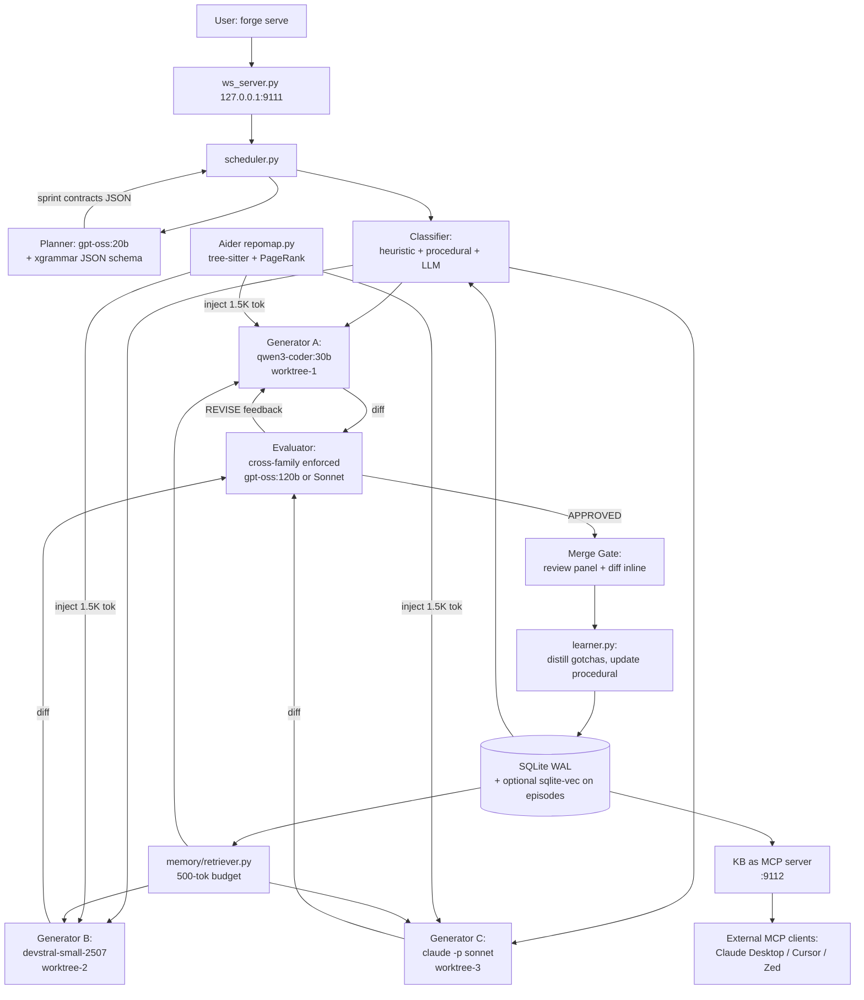
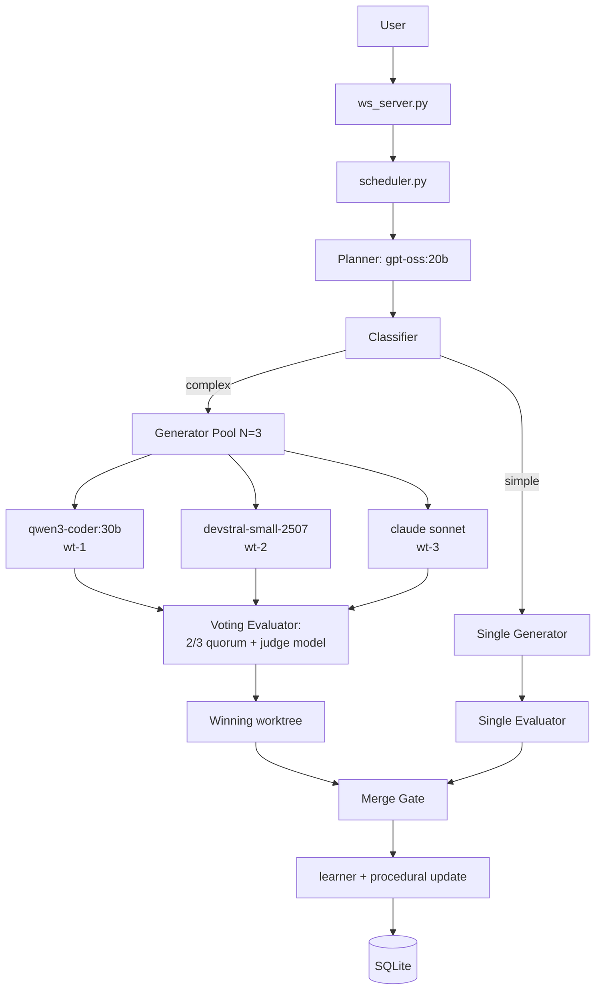
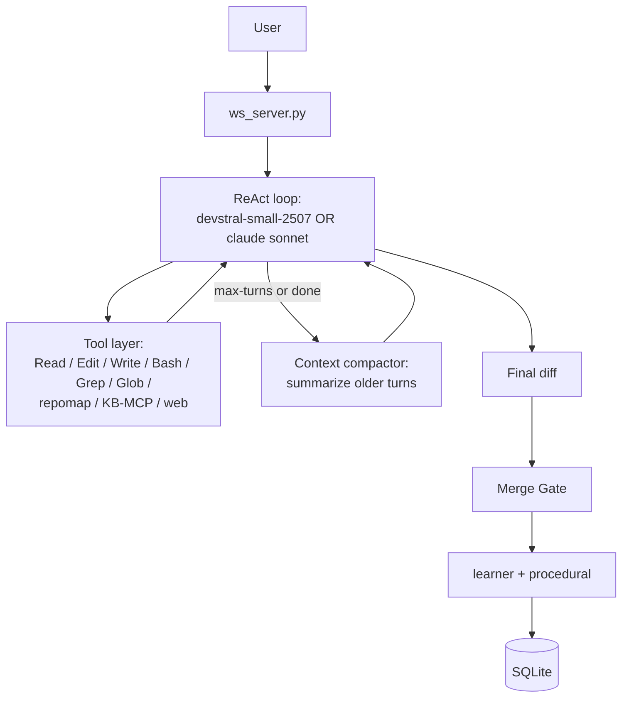

# Forge — Competitive Landscape & Architecture Report

**An opinionated, evidence-driven design brief for an open-weight, multi-agent coding-orchestration platform.**

- Author: principal-architect synthesis from six parallel research streams
- Date: 2026-04-30
- Branch: `develop`
- Reference codebase: `/Users/palmegyes/Development/forge` (Forge v2 spec — see [CLAUDE.md](../../CLAUDE.md))
- Companion notes (raw research, source for citations): [docs/research/notes/](notes/)
  - [01-codebase-review.md](notes/01-codebase-review.md)
  - [02a-closed-source-agents.md](notes/02a-closed-source-agents.md)
  - [02b-open-source-frameworks.md](notes/02b-open-source-frameworks.md)
  - [02c-2g-swarm-and-decisions.md](notes/02c-2g-swarm-and-decisions.md)
  - [02d-open-weight-llms.md](notes/02d-open-weight-llms.md)
  - [02e-2f-memory-sandbox-desktop.md](notes/02e-2f-memory-sandbox-desktop.md)

---

## Executive summary

Forge today is a working multi-agent coding orchestrator built on the assumption that the "real" generator is `claude -p` — a Claude Code subprocess running inside a git worktree, inheriting the user's MCP servers and CLAUDE.md instructions. Its three-agent split (planner → generator → evaluator), three-tier memory (episodic, semantic, procedural), git-worktree isolation, and SQLite-only persistence are all correct architectural calls, validated independently by Anthropic's published harness research, the MAST taxonomy of multi-agent failures (Cemri et al., [arxiv 2503.13657](https://arxiv.org/abs/2503.13657)), and the empirical results from Aider, OpenHands, and SWE-agent. The implementation is ~3K LOC of daemon code with ~1.9K LOC of tests and a complete Next.js dashboard — production-ready against Claude.

The hard problem the user is asking to solve is the second half: **make this run on open-weight LLMs from Hugging Face / Ollama** so the platform can rival Claude Code, Codex CLI, Cursor, Devin, and Windsurf without depending on closed APIs. The blocker is not raw code-generation quality — by April 2026, Qwen3-Coder-480B hits 66.5% on SWE-bench Verified and Devstral-Small-2507 hits 53.6%, both Apache 2.0, both within striking distance of frontier closed models. The blocker is **tool-calling reliability**: open-weight models emit malformed JSON 30–60% of the time without constrained decoding, evaluators can't reliably parse `PASS/FAIL` markers, and DeepSeek's tool calls are documented as "flaky" in production. Three of Forge's contracts (planner JSON output, evaluator verdict format, sprint-contract serialization) collapse under that condition unless explicitly hardened.

This report makes the following load-bearing recommendations:

1. **Pursue Architecture A** — the spec as written, plus open-weight hardening — over Architecture B (swarm-first) or Architecture C (single strong agent). The published evidence — Cognition's "Don't Build Multi-Agents" essay, the Anthropic blog's explicit carve-out that *"coding tasks with limited parallelization"* don't benefit from multi-agent fan-out, and the MAST result that 14 distinct failure modes plague multi-agent systems — supports a **structured, low-fan-out, evaluator-gated** topology over either extreme. Forge's worktrees + cross-model evaluator + merge gate is exactly the structural answer to Cognition's critique.
2. **Adopt three layers of tool-call defense** for any open-weight call: native parser (e.g., `hermes` for Qwen3) → constrained decoding (xgrammar via vLLM/SGLang) → tolerant parser (BAML schema-aligned parsing). Pure prompted-JSON without grammar enforcement is unsafe for the planner / evaluator contracts.
3. **Lift Aider's `repomap.py`** (MIT, tree-sitter + PageRank on the symbol graph) into Forge as `daemon/scanner/repomap.py` and inject the resulting map alongside the memory context. This closes the most important gap in the current implementation — Forge has no repo-level retrieval at all.
4. **Default Forge to Apache-2.0-only model lineup**: `gpt-oss:20b` (planner), `qwen3-coder:30b` (cheap generator), `devstral-small-2507` (medium generator), cross-family evaluator enforced automatically, `deepseek-r1-distill-qwen-32b` for non-tool reasoning. No Mistral Large 2, no Codestral (research-only licenses); no vanilla DeepSeek-V3 or R1 inside tool loops (use them as non-tool reasoners only).
5. **Stay browser-only for v1.** Add MCP-server export of Forge's KB next (one day of work, makes every other tool in the user's stack able to read what Forge has learned). Plan an ACP sidecar for v2 instead of a VS Code-specific extension.
6. **Kill criterion**: if Qwen3-Coder-30B + Devstral-Small-2507 cannot reach 25% on a 50-task SWE-bench Verified subset using Forge's harness within 60 days of starting MVP work, the open-weight thesis fails for self-host. Pivot to API-only with Anthropic + open-weight as fallback, or shut down.

The rest of this report walks the evidence and the design space behind those recommendations.

---

# Part 1 — Codebase Review

## 1.1 Spec summary

[CLAUDE.md](../../CLAUDE.md) defines Forge as a multi-agent orchestrator with three core roles: a **planner** that decomposes objectives into sprint-sized tasks with explicit `done_criteria`; a **generator** that writes code in isolated git worktrees via `claude -p` or Ollama; and an **evaluator** that verifies the generator's work from outside, on a different model, with read-only access to the diff. Memory is three-tier — episodic (raw task history), semantic (a curated knowledge base of one-line gotchas with confidence scoring), procedural (routing patterns) — plus a research cache. The spec mandates SQLite WAL mode, no external services (no LangChain, no CrewAI, no vector DB), MCP inheritance from the host's `.claude/` directory, hard budget caps with a model-downgrade cascade (Opus → Sonnet → Haiku → Ollama), and localhost-only WebSocket exposure.

The "what NOT to build" section is unusually restrictive and serves the project well: no vector embeddings, no external memory services, no agent framework, no Docker, no telemetry, no plugin system, no replacement of Claude Code's own auto-memory. The two-pip-deps rule (`httpx`, `websockets`) is partly aesthetic, partly philosophical — every dependency is a long-term liability.

## 1.2 Implementation inventory

The current branch tip on `develop` is a near-complete implementation. Daemon code totals **2,991 LOC** across 17 modules, tests total **1,893 LOC** across 16 files, and the Next.js UI is **~1,000 LOC** of components. Spec compliance is 95–100% on every module. Highlights:

| Module | LOC | Status |
|---|---|---|
| `daemon/db.py` | 446 | Complete. All six tables + indexes per spec, WAL mode enabled, schema matches CLAUDE.md exactly. |
| `daemon/scheduler.py` | 199 | Complete `execute_session()`: plan → dependency_waves → parallel sprints → evaluate → revise loop with `MAX_REVISIONS` enforcement. |
| `daemon/agents/planner.py` | 125 | JSON plan parsing, fallback to single sprint on parse failure, dependency chains. |
| `daemon/agents/generator.py` | 32 | Thin wrapper: builds memory-context-prefixed prompt, routes to executor. Correctly does *not* self-evaluate. |
| `daemon/agents/evaluator.py` | 138 | PASS/FAIL parsing per criterion, verdict logic. Cross-model selection enforced. |
| `daemon/memory/retriever.py` | 103 | Cross-store retrieval with the documented 500-token budget. |
| `daemon/worktree.py` | 182 | Create / remove / list / diff. Sanitizes names. `atexit` + signal-handler cleanup. |
| `daemon/agents/reviewer.py` | 149 | Five perspectives in parallel, partial synthesis. |

See [01-codebase-review.md](notes/01-codebase-review.md) for the full module-by-module table.

## 1.3 Spec vs reality gaps

Seven gaps are worth flagging, in descending severity:

1. **Reviewer synthesis logic is stubbed** ([daemon/agents/reviewer.py:148](../../daemon/agents/reviewer.py#L148) has a `# TODO: synthesis logic` comment). Per-perspective reviewers run, but the "critical-if-flagged-by-2+-reviewers" deduplication does not happen. Medium severity — UI shows per-perspective verdicts but no aggregated action list.
2. **Evaluator-Playwright integration is prompt-only**. The evaluator *tells* the Claude Code subprocess that Playwright MCP is available, but does not start a dev server, capture screenshots, or invoke the MCP directly. Visual regressions go undetected. This is correct given Forge's "delegate MCP usage to the inherited Claude Code session" philosophy, but it depends on a Claude Code session that has Playwright wired up.
3. **Learner confidence reinforcement is stubbed** ([daemon/memory/learner.py:72](../../daemon/memory/learner.py#L72) has the comment *"In a full implementation, we'd track which KB items were injected per sprint"*). The learner currently updates confidence on all items uniformly post-session, not on the specific items that were retrieved for the failed task. Convergence to optimal KB will be slower than designed; the fix is tracking `knowledge_items_injected` per sprint in the `episodes` table.
4. **Token estimation is naive** (`len(sanitized) // 4` in [daemon/executors/claude_code.py](../../daemon/executors/claude_code.py)). Budget projections are ±15–25% off because Claude's tokenizer does subword splitting; Claude Code's stdout doesn't return real token counts. The hard cap still works (the worst case is the cap triggers earlier), but session planning is conservative.
5. **Researcher web search is delegated**, not native. There's no fallback if Claude Code doesn't have a web-search MCP enabled.
6. **MCP availability is read but not validated**. `forge doctor` should ping each configured MCP server.
7. **No repo-level retrieval at all.** This is the largest *missing* feature, not a gap from spec. The KB injects gotchas; nothing tells the generator agent what code already exists in the repo. Aider, Cursor, Windsurf, and Plandex all solve this; Forge currently relies on the inherited Claude Code session's `Glob`/`Grep` tools, which works but means Forge's planner is blind to repo structure when it scopes sprints.

## 1.4 Open-weight viability critique

If a Forge user removes Claude entirely and runs the full pipeline on Qwen 2.5 Coder 32B / Llama 3.3 70B / DeepSeek-V3 / Mistral Large via Ollama, **five load-bearing assumptions break**:

1. **Planner expects strict JSON** ([daemon/agents/planner.py:60](../../daemon/agents/planner.py#L60), `_parse_plan`). The current parser does `text.find("[")`, `text.rfind("]")`, then `json.loads`. Open models produce ```json [...]``` fences, trailing commas, code-block comments, and partial outputs. Without a constrained-decoding step, raw Ollama + Qwen 2.5 / Llama 3.3 will fail this 30–60% of the time.
2. **Evaluator's PASS/FAIL parser is fuzzy but brittle** ([daemon/agents/evaluator.py:44–82](../../daemon/agents/evaluator.py#L44)). It looks for `"- PASS:"`, `"PASS"`, `"- FAIL:"`. Open models inject Unicode bullets (✓/✗), Markdown checkboxes, paragraph-style verdicts. Per-criterion accuracy drops below 50% without templated decoding.
3. **No context-window budgeting in the generator**. Claude Sonnet ships 200K, Mistral Large / Qwen3 ship 128K–256K, Llama 3.3 ships 128K (often deployed at 8K), Granite Code 34B ships 8K. A naive 50K-token prompt assembled from memory + sprint + repo silently truncates on Granite or fails on Llama-3.x-8K builds.
4. **MCP inheritance is meaningless on open weights**. Open models can't invoke Playwright MCP, Supabase CLI, or `gh` via stdio JSON-RPC because they don't speak the Anthropic/Claude tool-call format. Forge dodges this *for `claude -p` calls*; it surfaces only on Ollama-backed planner/evaluator/researcher paths.
5. **Heuristic classifier patterns are English-centric**. Phrasing drift matters less than the others — there's an LLM fallback — but fall-through to LLM classification on every task adds latency.

The summary verdict from [01-codebase-review.md](notes/01-codebase-review.md): Forge *can* use open models for planning + generation on simpler tasks, but **the evaluator and any Playwright-dependent tasks should stay on a strong reasoning model** (closed Sonnet, or strong open-weight like gpt-oss-120b or Devstral-Medium) for reliability. The "Architecture A — open-weight hardened" path in §3.1 below makes this explicit.

---

# Part 2 — Competitive & Architectural Research

This part synthesizes findings across closed-source agents (2A), open-source orchestration frameworks (2B), swarm/decision-making research (2C/2G), open-weight LLMs and tool-calling (2D), and memory/sandboxing/desktop surfaces (2E/2F). Citations live in the per-section notes files; the most-load-bearing claims are linked inline here.

## 2A. Closed-source coding agents — patterns and divergence

The eight production agents surveyed in [02a-closed-source-agents.md](notes/02a-closed-source-agents.md) — Claude Code, OpenAI Codex CLI, Cursor, Windsurf/Cascade, Devin, Aider, Continue.dev, plus Sweep/Cody/Tabby/Plandex — converge on a common loop and diverge on five key axes.

### 2A.1 The convergent loop

Every production agent now runs the same outer loop: **prompt → tool call → tool result → repeat → final text**. Read-only tools (Read, Glob, Grep, MCP read tools) execute concurrently; state-mutating tools (Edit, Write, Bash) execute sequentially. The `maxTurns` / `maxBudgetUsd` cap is now standard. This is essentially the ReAct pattern (Yao et al., [arxiv 2210.03629](https://arxiv.org/abs/2210.03629)) hardened with explicit tool-execution semantics and budget controls.

Implication for Forge: Forge's `scheduler.execute_sprint` already runs this exact loop indirectly via `claude -p`. For open-weight executors, Forge needs to implement the same read-concurrent / write-sequential rule explicitly, because the open-weight tool-call layer doesn't enforce it.

### 2A.2 Hybrid retrieval has won over pure RAG

Anthropic's harness blog explicitly calls out tree-sitter-based indexing as inferior to JIT search for Claude Code. Cursor and Windsurf still maintain embeddings but treat them as one signal among many (filename filters, symbol filters, recent-file weighting, M-Query reranker). Aider's tree-sitter PageRank repo map is a strong baseline that doesn't use embeddings at all and matches RAG-grade systems on Aider polyglot.

The pattern is: **persistent project context** (`CLAUDE.md` / `AGENTS.md` / `.cursorrules` / `.windsurfrules`, re-injected on every request and prompt-cached) **plus just-in-time tools** (`Glob`, `Grep`, Sourcegraph Search) **plus optional indexed retrieval** as a third leg. No production agent shipped in 2025–2026 relies on pure RAG.

This validates Forge's "no embeddings on the KB" stance and points to the missing piece: a deterministic repo-level retrieval layer. Aider's `repomap.py` is the obvious lift candidate.

### 2A.3 Compaction is table stakes; resets are model-dependent

Every long-running agent now has an answer to context overflow:

- **Claude Code**: automatic compaction triggered on context fill, plus manual `/compact <focus>` and `/rewind`. The Anthropic harness blog reports that Sonnet 4.5 needed full *context resets* (start a fresh agent with structured handoff via `feature-list.json` + `claude-progress.txt` + git log); Opus 4.6 made resets unnecessary.
- **Cognition (Devin)**: explicitly opposes resets — *"never reset, always carry full traces forward, compress instead"* — and uses a dedicated compression model.
- **Cursor**, **Windsurf**: pipeline-level trimming and window-aware context assembly.

Implication for Forge: the open-weight equivalent of compaction is a pure-text summarization pass (cheap on Ollama). Forge does not currently implement this; it relies on session-level `MAX_REVISIONS=2` to bound context. For longer sessions on open weights with 32K context windows, an in-session compaction step on each generator's worktree history is essential.

### 2A.4 Sub-agent dispatch is the open question

Anthropic and Cursor invest heavily in sub-agent / multi-agent dispatch — Anthropic's [multi-agent research blog](https://www.anthropic.com/engineering/built-multi-agent-research-system) reports +90.2% over single-agent Opus on breadth-first research, with a 15× token cost. Cursor 2.0 spawns up to 8 parallel agents on git worktrees. Cognition rejects this entirely ("Don't Build Multi-Agents") on the grounds that parallel agents accumulate conflicting implicit decisions; the Flappy Bird / Mario Bros failure example is canonical.

The Anthropic blog itself carves out the limit: *"coding tasks with limited parallelization"* don't benefit from fan-out. **Forge's bet** — that git worktrees provide enough filesystem isolation to recover task-level parallelism for code, and that the evaluator + merge gate provide explicit coordination at the integration boundary — is the central architectural wager. It's defensible: worktrees make implicit decisions explicit at the diff boundary, where the evaluator catches them.

### 2A.5 Planner/executor splits exist in five distinct shapes

| Pattern | Example | Coupling |
|---|---|---|
| **Architect mode** (reasoning model writes intent, cheap model materializes edits) | Aider | Sequential, two-model |
| **Planner + fast-apply** (planner emits intent, latency-optimized model materializes patch) | Cursor | Sequential, two-model, latency-tuned |
| **Cascade dual-agent** (planner runs *concurrently* alongside executor) | Windsurf | Concurrent, planner refines plan during execution |
| **Interactive planner** (human approves spec before autonomous execution) | Devin 2.0 | Sequential, human-in-loop |
| **Generator/evaluator** (cross-model evaluator on different model than generator) | Anthropic harness | Sequential, cross-model |

Forge's design aligns most closely with Anthropic's pattern — same-spec sprint contract, same cross-model evaluator. The Aider/Cursor architect pattern is *complementary* (it splits the generation step itself into reasoning + edit-materialization) and worth considering as an internal optimization on the generator side.

### 2A.6 The persistent project file has standardized

`CLAUDE.md` (Anthropic), `AGENTS.md` (OpenAI Codex, now cross-vendor), `.cursorrules` (Cursor), `.windsurfrules` (Windsurf), `CONVENTIONS.md` (Aider), `.continue/` (Continue). Same idea: a checked-in Markdown file that is re-injected on every request. This is the field's de facto portable agent-context standard. Forge already inherits `CLAUDE.md` automatically — that is the right move.

## 2B. Open-source orchestration frameworks — what to lift, what to skip

Sixteen frameworks were evaluated in [02b-open-source-frameworks.md](notes/02b-open-source-frameworks.md). The findings sort cleanly into "ban as a dependency, lift the idea," "stagnation traps," and "lift candidates."

### 2B.1 The bans Forge has are correct

| Framework | Why Forge bans it | Verdict |
|---|---|---|
| **CrewAI** | Logging/observability gap (multiple production engineers report `print`/`log` inside Tasks misbehaves); role-orchestration scales smoothly only to ~5 agents; Forge expects 10–20 parallel worktrees; pervasive YAML lock-in. | Ban is correct. |
| **LangChain core** | Dep gravity — Pydantic, langchain-core, transitive surface — violates Forge's two-pip-deps rule. | Ban is correct. |
| **LangGraph** | The `StateGraph` runtime itself is clean, but it pulls LangChain transitive deps. Forge's planner→generators→evaluator is a shallow DAG (~50 LOC reimplementation). | Ban is correct; lift the *idea* (state-as-DAG, checkpointing) not the library. |
| **AutoGen** | Microsoft put AutoGen into maintenance mode and is pushing migration to Microsoft Agent Framework. Adopting it is signing up for re-platforming. | Don't depend; study the event-driven core for `ws_server.py` design. |
| **Magentic-One** | Ported into AutoGen, which is itself in maintenance. Task-ledger / progress-ledger split is a nice idea. | Skip; the *task-ledger / progress-ledger* split validates Forge's `sprint contract` + `evaluator verdict` design. |
| **Codel** | AGPL-3.0 (copyleft) + last release April 2024. | Disqualified. |
| **R2R** | Vector RAG platform; Forge explicitly doesn't want vectors. Slowing activity (last release June 2025). | Skip. |

### 2B.2 Lift candidates

Three frameworks are explicitly designed for component extraction or have sufficiently clean source to fork from:

| Component | From | License | What it gives Forge | Lift mode |
|---|---|---|---|---|
| `LocalPythonInterpreter` AST sandbox (~150 LOC) | smolagents | Apache 2.0 | Safe Python eval for evaluator's "verify by running this assertion" step | **Copy** |
| `should_block_action` + `guard_multiline_input` (~30 LOC) | SWE-agent | MIT | Pre-execution safety on agent-emitted commands; salvages weaker open-weight models | **Copy** |
| `MultiStepAgent` skeleton (~200 LOC reimplementation) | smolagents | Apache 2.0 | Reference ReAct loop with optional planning steps | **Idea — reimplement** |
| Code-as-action pattern | smolagents / OpenHands CodeAct | Apache / MIT | Robust tool-use for open-weight Ollama planner; sidesteps JSON tool-call fragility | **Pattern** |
| Three-tier memory (core/recall/archival) | Letta | Apache 2.0 | Validated upgrade path beyond Forge's flat KB | **Idea, not dep** |
| Aider's `repomap.py` | Aider | MIT | Tree-sitter + PageRank repo map — closes Forge's biggest retrieval gap | **Copy** the file directly |
| OpenHands Docker runtime | OpenHands | MIT | Sandboxed bash/Jupyter/Chromium for `--sandbox=docker` escalation | **Reference / fork** |

### 2B.3 The Claude-Code-clone wave validates Forge's bet

The 2025–2026 wave of "open-source Claude Code" projects is illuminating. The closest existing analog to Forge's design is the **OpenClaw plugin** (`Enderfga/openclaw-claude-code`, MIT, ~417 stars): a multi-agent council of Claude Code instances with git-worktree isolation and consensus voting. **OpenCode** (`sst/opencode`, MIT, ~152K stars) ships a leaner two-agent UX (build agent + plan agent) that's a useful baseline to benchmark Forge against. **Cline** (~61K stars, Apache-2.0) is a VS Code extension that uses Claude's computer-use; Forge's value-add over Cline is the orchestration layer (multi-sprint, cross-model evaluation, persistent KB).

The pattern observation: every credible Claude Code clone is MIT or Apache-2.0; every one wires up MCP because Claude Code did; terminal-first is winning over browser-first; the multi-agent council with worktree isolation is the closest existing prior art to Forge.

**Implication**: Forge is not pioneering an unprecedented design. It's the most opinionated and most spec'd version of an emerging pattern. That's good — it means the underlying architecture is convergent, not speculative.

## 2C / 2G. Multi-agent paradigms and decision-making — when fan-out wins, when it doesn't

The full evidence is in [02c-2g-swarm-and-decisions.md](notes/02c-2g-swarm-and-decisions.md). Three key findings shape Forge's design.

### 2C.1 Cross-model evaluation beats self-evaluation — strongly

Anthropic's harness blog states the principle directly: *agents tend to confidently praise their own work even when it's mediocre*. The MT-Bench self-enhancement-bias paper (Zheng et al., [arxiv 2306.05685](https://arxiv.org/abs/2306.05685)) quantifies it: **Claude-v1 favors itself with a 25% higher win rate, GPT-4 with 10%**. Reflexion (Shinn et al., [arxiv 2303.11366](https://arxiv.org/abs/2303.11366)) validates verbal-feedback loops where the critic is external; Self-Refine (Madaan et al., [arxiv 2303.17651](https://arxiv.org/abs/2303.17651)) documents ~20% gains when the same LLM critiques its own work *but only* with a calibrated prompt — and Forge's design explicitly rejects same-model criticism.

The literature unambiguously supports Forge's planner / generator / evaluator separation. Two refinements worth making:

1. **Cross-family** evaluation, not just cross-prompt. Sonnet-evaluating-Opus shares family blind spots. When the generator is Sonnet, the evaluator should ideally be Devstral, Qwen3-Coder, or gpt-oss — not another Claude. Forge's classifier should enforce `evaluator_family != generator_family` automatically.
2. **Skeptical evaluator prompt** (Forge already does this). MT-Bench shows judges default to leniency unless prompted to fail on doubt.

### 2C.2 Multi-agent helps when you can decompose, hurts when you can't

The Anthropic blog reports +90.2% over single-agent Opus on breadth-first research with 15× the token cost — but explicitly carves out *"coding tasks with limited parallelization"* as a domain where the fan-out doesn't help. The MAST taxonomy (Cemri et al., [arxiv 2503.13657](https://arxiv.org/abs/2503.13657)) annotated 1,600+ traces across 7 popular MAS frameworks and identified **14 failure modes in 3 categories**: system design (bad role specs, unclear responsibilities, weak coordination), inter-agent misalignment (information not propagating, conflicting goals, context loss across handoffs), and task verification (no termination condition, premature termination, no end-to-end check).

Cognition's "Don't Build Multi-Agents" essay summarizes the mechanism behind these failures verbatim: *"Actions carry implicit decisions, and conflicting decisions carry bad results."* Their canonical failure: a parallel-subagent build of Flappy Bird where one subagent mistook the subtask and started building Super Mario Bros backgrounds while another built non-game-like birds.

Forge's structural answer:

- **Worktrees** make the implicit decisions concrete at the diff boundary.
- **The evaluator** catches conflicting decisions because it sees the diff *before* merge.
- **The merge gate** is an explicit coordination step.

This is exactly the kind of structural mitigation Cognition's essay warns is missing in naive multi-agent systems. But the warning still applies: **the planner must be honest about when sprints are independent**. If two sprints touch the same files, they should serialize. Forge's planner today emits a `depends_on` array; the planner needs to be conservative and over-declare dependencies. Forcing parallelism on coupled work will produce the Flappy Bird failure mode.

### 2C.3 Decision-theoretic patterns — what to bake in

| Pattern | Source | Recommendation for Forge |
|---|---|---|
| **ReAct** | Yao et al., [arxiv 2210.03629](https://arxiv.org/abs/2210.03629) | Already the inner loop via `claude -p`. Keep it; it's the right baseline. |
| **Plan-and-Solve** | Wang et al., [arxiv 2305.04091](https://arxiv.org/abs/2305.04091) | The planner stage is project-level Plan-and-Solve. Keep. |
| **Reflexion** | Shinn et al., [arxiv 2303.11366](https://arxiv.org/abs/2303.11366) | Forge's evaluator-feedback → revision loop is a Reflexion implementation. The learner extracting one-line gotchas from failure-resolution pairs is verbatim Reflexion. Validated. |
| **ADaPT** (as-needed decomposition) | Prasad et al., [arxiv 2311.05772](https://arxiv.org/abs/2311.05772) | **Add as a recovery mode**: when a sprint fails after `MAX_REVISIONS`, instead of escalating to user, recursively decompose into smaller sprints. Cheap on Ollama. +27–33% on benchmarks. |
| **Self-Consistency** | Wang et al., [arxiv 2203.11171](https://arxiv.org/abs/2203.11171) | **Optional for high-stakes sprints**: N=3 generators in parallel worktrees, evaluator picks winner. This is the Anthropic parallel-subagents pattern at the sprint level. |
| **Tree of Thoughts / LATS / MCTS-for-code** | Yao et al. [arxiv 2305.10601](https://arxiv.org/abs/2305.10601), Zhou et al. [arxiv 2310.04406](https://arxiv.org/abs/2310.04406) | Heavy. Useful only when there's a fast verifier (compile + tests). Forge's evaluator + test runs *are* a process-reward signal — but the cost is rarely worth it for single-shot generation. Don't bake in; revisit if benchmarks plateau. |

### 2C.4 Cost/latency-aware routing maps directly onto Forge's classifier

**RouteLLM** (LMSYS, [arxiv 2406.18665](https://arxiv.org/abs/2406.18665)) reports *"cost reductions of over 85% on MT Bench, 45% on MMLU, and 35% on GSM8K vs. using only GPT-4, while still achieving 95% of GPT-4's performance"* by training a binary router on Chatbot Arena preferences. **FrugalGPT** (Chen, Zaharia, Zou, [arxiv 2305.05176](https://arxiv.org/abs/2305.05176)) reports *up to 98% cost reduction* matching GPT-4 via a cascade — try cheap, escalate to expensive on low confidence.

Forge's classifier (heuristic + procedural memory + LLM fallback) is an online RouteLLM. Forge's budget downgrade cascade (Opus → Sonnet → Ollama on budget exhaustion) is FrugalGPT's cascade applied to a global budget rather than per-query confidence. The procedural memory table (`task_pattern → recommended_model + success_rate`) **is a learned router that improves with use** — exactly what RouteLLM trains offline, except Forge does it online per project.

**Refinement to bake in**: every evaluator verdict should auto-update the procedural memory. Forge currently does this on success/failure but not deeply enough — the routing improvement compounds across sessions only if the writeback happens reliably. This is one of the highest-leverage wins.

### 2C.5 Approval taxonomies and merge gate design

OpenAI Codex's three approval modes — `suggest`, `auto-edit`, `full-auto` — are the cleanest taxonomy in the wild. Forge's merge gate operates at the *worktree* level (per-sprint approval) which is the Anthropic harness pattern and the right default. Two refinements:

1. **Default to "show diff inline, require deliberate approval per worktree"** rather than offering a one-click "approve all." Cognition's warning that "actions carry implicit decisions" applies most strongly at the merge boundary, where many decisions land at once.
2. **Per-tool-call approval for destructive operations** (rm, force-push, schema migrations) even in full-auto. Inherit this from Claude Code's permission system; expose as an explicit allow/deny list in Forge config.

## 2D. Open-weight LLMs — the decisive sub-question

The full benchmark survey is in [02d-open-weight-llms.md](notes/02d-open-weight-llms.md). The compressed picture as of April 2026:

### 2D.1 The model lineup that matters

| Model | License | Context | SWE-bench Verified | Aider polyglot | BFCL v3 | Forge role |
|---|---|---|---|---|---|---|
| **Qwen3-Coder-480B-A35B** | Apache 2.0 | 256K → 1M | **66.5%** Pass@1 | n/r | n/r | Server-class generator (8× H100) |
| **Qwen3-Coder-30B-A3B (Flash)** | Apache 2.0 | 256K → 1M | n/r | n/r | n/r | **Cheap-tier generator default** |
| **Qwen3-235B-A22B-Instruct-2507** | Apache 2.0 | 256K → 1M | n/r | 57.3% | **70.9%** | Server-class evaluator/planner |
| **Devstral-Small-2507** | Apache 2.0 | 128K | **53.6%** (OpenHands) | n/r | n/r | **Medium-tier generator** |
| **gpt-oss-120b** | Apache 2.0 | n/r (long) | **62.4%** (high reasoning) | n/r | ~67–68% | Server-class generator/evaluator |
| **gpt-oss-20b** | Apache 2.0 | n/r | 47.9% | n/r | ~67–68% | **Planner/evaluator default for laptops** |
| **DeepSeek-R1** | MIT | 128K | 49.2% | 53.3% / 71.4% (0528) | n/r | Reasoner only (no tool loops) |
| **Llama 3.3 70B** | Llama 3.3 Community | 128K | n/r officially | n/r | 77.3% v2 | Solid evaluator (no parallel calls) |
| **Llama 4 Scout / Maverick** | Llama 4 Community | 1M / 10M | n/r officially | 15.6% | n/r | Long-context only; weak coding |
| **Granite Code 34B** | Apache 2.0 | 8K | n/r | n/r | 57.1% | IBM-blessed safe fallback |
| **DeepSeek-V3** | MIT (code) + Model License (weights, commercial OK) | 128K | 42.0% (Agentless) | 49.6% / 55.1% (0324) / 70.2% (V3.2) | Flaky in practice | Server-class but tool calls unreliable |
| **Mistral Large 2 / Codestral** | Mistral Research / MNPL | 128K / 32K | n/r | n/r | n/r | **Disqualified** — non-commercial |

`n/r` = not reliably reported on the official model card or canonical leaderboard at writing time.

The single most important finding: **Devstral-Small-2507 hits 53.6% on SWE-bench Verified, fits on a single 24GB GPU, and is Apache 2.0**. That's the model that proves the open-weight thesis for Forge — a developer with a 4090 can run a real coding agent at Sonnet-3.5-class quality. Pair it with Qwen3-Coder-30B-A3B for a cheaper cheap tier and gpt-oss-20b for laptop-scale planning, and you have a fully-Apache-2.0 default lineup with no license traps.

### 2D.2 Tool-calling reliability — the make-or-break problem

Open weights *will* emit malformed JSON. The right defense is three layers:

| Layer | Tools | Coverage |
|---|---|---|
| **Native tool-call parser** (model-specific, in vLLM/SGLang) | `hermes` (Qwen3), `mistral` (Devstral), `llama3_json` / `llama4_pythonic` (Llama 3/4), `granite` / `granite4`, `deepseek_v3`, `harmony` (gpt-oss), `glm45`, `kimi_k2` | First line of defense; reliable for well-tested models |
| **Constrained decoding** | **xgrammar** (default in vLLM and SGLang, near-zero overhead), **Outlines** (transformers + llama.cpp), **llguidance** (lazy automata, <50µs/token) | Provably valid JSON output; required at session boundaries (planner output, evaluator verdict) |
| **Tolerant parser** | **BAML** schema-aligned parsing — parses messy JSON-in-markdown into typed objects without grammar enforcement | Fallback for users on Ollama or non-vLLM backends |

vLLM with xgrammar is the Forge primary self-host target; Ollama for laptop deploys (passes through to llama.cpp's GBNF grammars + per-model templates). **TGI entered maintenance mode in December 2025**; do not target it. **TensorRT-LLM** is overkill for a developer tool.

### 2D.3 What the agentic-coding community actually does in 2026

Verbatim from the OpenHands LM team and the practice across Aider, smolagents, Qwen-Agent, Cline:

- **Models smaller than ~32B are not recommended for agentic coding.** Instruction-following degrades materially below 32B for multi-step workflows.
- **OpenHands does not trust raw tool-call JSON** — it parses, validates, re-prompts on failure.
- **Aider sidesteps the problem** by using its own search/replace block format rather than function calls.
- **smolagents leans on code-as-action** — the agent emits Python, which is in the training distribution and easier to validate by AST-walking than JSON.
- **Qwen-Agent ships its own MCP-aware client** with tolerant parsing for Qwen3.

The synthesis for Forge: **never rely on a single tool-call parser for an open-weight model in production**. Belt-and-suspenders the decoder, then belt-and-suspenders the parser.

### 2D.4 Inference engine recommendation

| Engine | Primary fit |
|---|---|
| **Ollama** | First-class local target. The "developer just runs `ollama serve`" path. Forge's primary local executor. |
| **vLLM (OpenAI-compatible endpoint)** | Second target — for users with a real GPU or remote box. Pass tool spec via OpenAI tool-calling API, `--tool-call-parser` per model. |
| **LiteLLM** | Optional adapter when users mix providers (Anthropic + Ollama + vLLM). Forge does not depend on it; just speaks OpenAI API so users can put LiteLLM in front. |
| **SGLang** | Documented advanced option for users wanting better structured-output throughput. |
| **MLX / MLX-LM** | Mac fallback. Qwen3-Coder, Devstral, gpt-oss all have MLX builds. |
| **TGI** | Avoid (maintenance mode). |
| **TensorRT-LLM** | Skip (production server, not developer tool). |

Forge's executor abstraction should expose two engines beyond `claude -p`: an `ollama` executor (REST API at `http://127.0.0.1:11434`) and a generic `openai_compatible` executor (any URL, any model name). Both pass the OpenAI-format `tools` array. The classifier picks the model; the executor doesn't care what backend serves it.

## 2E. Memory and retrieval — Forge's stance is mostly correct

The full survey is in [02e-2f-memory-sandbox-desktop.md](notes/02e-2f-memory-sandbox-desktop.md).

### 2E.1 The no-embeddings KB stance is defensible

For a per-project KB capped at 200 one-line items, SQLite LIKE on a topic-filtered subset of ≤200 rows runs in microseconds. Embeddings would add a model dependency, a vector store, and ~768–1536 floats per item with no measurable retrieval-quality gain at this scale. The **200-item cap is the design feature** — it forces curation quality (the learner) to be the bottleneck, not retrieval algorithm.

| System | Approach | Forge fit |
|---|---|---|
| **Letta** (formerly MemGPT) | Three-tier core/recall/archival; core memory is structured text the agent self-edits via tool calls | Conceptual fit; infra (Postgres + pgvector) is overkill |
| **Mem0** | LLM extraction → vector + BM25 + entity graph | Wrong abstraction (chat memory, not curated KB) |
| **Zep / Graphiti** | Temporal knowledge graph with `valid_at` / `invalid_at` | Heavy; the temporal pattern is worth borrowing |
| **Cognee** | Pluggable vector + graph backends | Closest to Forge philosophy but adds graph DB |
| **sqlite-vec** | SQLite extension; KNN via SQL | **Tempting** — but ships as a binary extension (.so/.dylib/.dll), not pure Python. Adds a wheel dep. |
| **LanceDB** | Embedded columnar vector DB | Heavy; for billion-scale, not 200 items |
| **Turbopuffer** | Serverless S3 + NVMe vector + BM25 | Violates "no external services" rule |

### 2E.2 Where the no-embeddings stance gets shaky — episodic store

The episodes table grows without bound. After a few months, "find similar past failures" via SQL LIKE on a multi-thousand-row corpus is the weak link — past task descriptions don't share keywords with the current task even when they're conceptually similar. **This is the one place where embeddings earn their keep.**

**Recommendation**: hold the line on no-embeddings *for the knowledge base*. Add **sqlite-vec as an optional, gated extension for the episodic store**. The two-deps rule is preserved if sqlite-vec ships as a Python wheel (it does). This gets vector recall over episodes without adding a vector DB to the architecture diagram.

### 2E.3 The biggest gap — repo-level retrieval

Forge currently has nothing for repo-level retrieval. Every generator agent gets a memory context (KB injection) but no codebase map. The strongest open-source pattern is **Aider's `repomap.py`**:

- Tree-sitter `.scm` query files extract `def` and `ref` tags for every supported language.
- Identifiers become graph nodes; reference edges are weighted by frequency. Edges originating from files already in the chat get a 50× boost; edges to identifiers the user mentioned get 10×.
- `nx.pagerank(G, weight='weight', **pers_args)` computes file importance.
- Binary search fits the highest-ranked subset into the `--map-tokens` budget (default 1000), with 15% error tolerance.
- The map is sent to the LLM with every request.

**Lift `aider/repomap.py` directly.** It's MIT, ~500 LOC, depends on tree-sitter and networkx, and will close Forge's biggest retrieval gap in one PR. Inject the map (token budget ~1500) alongside the memory context. This composes perfectly with the no-embeddings KB stance — both are deterministic, both are cheap.

## 2F. Sandboxing and the desktop surface

### 2F.1 Worktrees are the right v1 sandbox

Forge's threat model is *"agent makes a mistake,"* not *"agent is malicious."* Trusted code that the developer intentionally invoked. Worktrees (zero startup cost, no security isolation but real filesystem isolation) are the correct default.

The two real risks:

1. **Generator agents that run `npm install`** (or pip / cargo) execute arbitrary postinstall scripts. Same threat humans face, but agents are more likely to run install commands.
2. **Long-running parallel agents exhaust shared resources** (DB connections, ports, disk). Worktrees don't isolate this.

Tiered escalation roadmap:

| Tier | Sandbox | When |
|---|---|---|
| **Default** | git worktree | 95% of tasks |
| **Optional** (`--sandbox=bwrap` on Linux) | bubblewrap with read-only `$HOME`, write only to worktree | Untrusted dependency installs; network-touching agents |
| **Optional** (`--sandbox=docker`) | Thin Docker wrapper, default image overridable | Cross-platform need for container isolation |
| **Skip** | macOS sandbox-exec | Apple deprecated it on 15.4; brittle in practice; recommend Docker on macOS |

### 2F.2 Stay browser-only for v1; the asymmetric move is MCP server export

Forge is currently browser-only. That is correct for the *control* surface (sprint-level dashboards, multi-worktree visualization, KB browser, cost meter). What's missing is the *participation* surface — inline diff approval in the editor, system-tray notifications, OS-native toasts.

The right v2 architecture:

1. **Keep the daemon** (already a long-running process on 127.0.0.1:9111). Add a system-tray icon for status + quick actions.
2. **Keep the browser dashboard** for mission control.
3. **Add an ACP-speaking sidecar.** Implement Forge as a Zed [Agent Client Protocol](https://github.com/zed-industries/agent-client-protocol) agent so any ACP-aware editor (Zed today, plausibly more later) gets the participation surface for free. Apache 2.0, multi-language SDKs.
4. **Skip the VS Code-specific extension** unless adoption demands it.

**The single highest-ROI desktop move**: **expose Forge's KB as an MCP server**. ~1 day of work. Zero new UI. Immediately makes Forge's KB queryable by Claude Desktop, Cursor, Continue, and every other MCP-aware tool in the user's stack. Forge already *consumes* MCP via Claude Code; exposing the KB *as* MCP closes the loop. Do this before any IDE plugin work.

---

# Part 3 — Synthesis and Recommendations

## 3.1 Three reference architectures

I evaluated three architectural blueprints Forge could pursue. Each is presented as a Mermaid diagram + scoring table. The recommendation at the end is unambiguous.

### 3.1.1 Architecture A — "Forge as specified, hardened for open weights"

Keep Forge's planner/generator/evaluator + worktrees + SQLite. Swap Claude for Qwen3-Coder-30B / Devstral-Small-2507 via Ollama. Add three-layer tool-call defense (native parser + xgrammar + BAML). Add Aider's repomap.py. Keep cross-model evaluator with mandatory cross-family enforcement.



**Trade-offs:**

| Dimension | Score |
|---|---|
| Implementation cost (vs current) | **Low** — ~3 weeks of hardening: repomap.py lift, xgrammar wiring, cross-family classifier rule, BAML fallback, MCP server export |
| Expected SWE-bench Verified (open weights only) | **35–50%** with Devstral-Small + OpenHands-style validation; **50–62%** if you include Qwen3-Coder-480B server-side |
| Hardware (cheap path) | One RTX 4090 (24GB) running Devstral-Small-2507; laptop with 16GB for gpt-oss-20b |
| Hardware (premium path) | One H100 (80GB) for gpt-oss-120b; or 8× H100 for Qwen3-Coder-480B |
| Failure modes | (1) Open-weight tool-call regressions on new model versions; (2) repomap stale on large monorepos; (3) cross-family enforcement fails when only one open-weight family is installed |

### 3.1.2 Architecture B — "Swarm-first"

Orchestrator dispatches N parallel subagents (à la Anthropic's research system) with debate/voting evaluator. Same backbone as A, but every "harder" sprint runs N=3 generators in parallel worktrees and a voting evaluator picks the winner. Higher token cost; better recall; harder to debug.



**Trade-offs:**

| Dimension | Score |
|---|---|
| Implementation cost | **Medium-high** — voting evaluator is a real new component; quorum logic; deduplicate cost-tracking across N worktrees |
| Expected SWE-bench Verified | **+5–10% over A** based on Anthropic's 90.2% improvement on research, scaled down per the explicit "limited parallelization for coding" caveat |
| Hardware | 3× the GPU memory for parallel generators; Mac users can't run 3 simultaneous LLMs |
| Token cost | **3–5×** Architecture A (Anthropic measured 15× on research; coding is cheaper because parallelization is more constrained) |
| Failure modes | Cognition's Flappy Bird / Mario Bros divergence; voting deadlocks on equally-broken outputs; debugging becomes triple-trace-correlation |

### 3.1.3 Architecture C — "Single strong agent + great tools"

One capable agent loop (SWE-agent-style ACI), no multi-agent split, lean on tooling and retrieval. Cognition's preferred design ("Don't Build Multi-Agents"). Cheapest, simplest, possibly highest quality on coding per Cognition's argument.



**Trade-offs:**

| Dimension | Score |
|---|---|
| Implementation cost | **Medium-low** — strip out planner/evaluator entirely; build ACI tool layer; build context compactor. ~4 weeks. But: throws away most of Forge's existing 3K LOC. |
| Expected SWE-bench Verified | **45–53%** with Devstral-Small + OpenHands-style scaffold (Devstral's own published number) |
| Hardware | Lightest — one model, no parallel anything |
| Token cost | **Lowest of the three** |
| Failure modes | Cross-model evaluation lost; no separation of role; falls into MT-Bench self-enhancement bias on long sessions; no procedural memory feedback loop because there's no per-sprint judgment to learn from |

### 3.1.4 Recommendation

**Pick Architecture A.** Three reasons:

1. **The literature converges on it.** Cross-model evaluation > self-evaluation (MT-Bench self-bias quantified). Plan-and-Solve > one-shot. Verbal feedback loops > single-pass. Architecture C throws away exactly the structural advantage the evidence supports.
2. **Architecture B's coding gains don't justify the cost.** Anthropic explicitly carved out coding as a domain where multi-agent fan-out underperforms. The MAST taxonomy documents the failure modes. The 3–5× token cost is real. Reserve B as a *per-sprint optional mode* (Self-Consistency for high-stakes sprints) rather than the default.
3. **Architecture A respects 95% of the existing 3K LOC.** Architecture C requires throwing it out.

**The hybrid recommendation**: Architecture A as the default, with **Self-Consistency-on-marked-critical-sprints as an opt-in escalation** (this is Architecture B applied surgically). When a sprint is marked `critical: true` in the contract, run N=3 generators in parallel worktrees, evaluator picks winner. Cheap insurance for the small fraction of sprints where it matters.

## 3.2 The team to build this

A six-month roadmap to ship Architecture A as a credible open-source product needs **9–11 people**. Customer-facing roles are essential — open source projects live or die on community velocity, and developer tooling especially needs DevRel from week one.

### 3.2.1 Engineering (5–6)

| Role | Headcount | Skill profile | Reference engineers/teams to recruit from |
|---|---|---|---|
| **Agent-runtime engineer** (lead) | 1 | Owns the scheduler, worktree manager, generator/evaluator interfaces, revision loop. Must have shipped a real agent loop before. | Aider maintainer ([Paul Gauthier](https://github.com/paul-gauthier)); SWE-agent core (Princeton — [John Yang](https://github.com/john-b-yang), [Carlos Jimenez](https://github.com/carlosejimenez)); OpenHands core ([Xingyao Wang](https://github.com/xingyaoww)); ex-Cursor agent infra |
| **Inference / serving engineer** | 1 | Owns the open-weight stack — vLLM/Ollama/SGLang plumbing, xgrammar/BAML integration, model lifecycle, MLX builds. | vLLM contributor ([Woosuk Kwon](https://github.com/WoosukKwon), [Zhuohan Li](https://github.com/zhuohan123)); SGLang core ([Lianmin Zheng](https://github.com/Ying1123)); Ollama contributors; MLX-LM team at Apple |
| **Retrieval / memory engineer** | 1 | Owns the KB, episodic store, learner, the repomap lift, the procedural-memory feedback loop. | Aider repomap author (Paul Gauthier himself); Letta core ([Charles Packer](https://github.com/cpacker), Sarah Wooders); Mem0 core; ex-Sourcegraph SCIP |
| **Sandbox / security engineer** | 0.5–1 | Owns worktree lifecycle hardening, optional bwrap/Docker tiers, MCP server hardening, secret-scanning on KB writes. | Codex sandbox contributors; bubblewrap maintainers; Daytona core; ex-E2B |
| **IDE / desktop / front-end engineer** | 1 | Owns the Next.js dashboard plus eventual ACP sidecar and system-tray daemon. | Zed Industries (ACP); Continue.dev front-end; ex-VS Code extension authors |
| **Eval / benchmark engineer** | 1 | Owns the SWE-bench Verified harness, Aider-polyglot replication, internal eval suite, regression detection on every model bump. | OpenHands LM team; Princeton SWE-agent benchmark contributors; Aider polyglot maintainers |

### 3.2.2 Research (1–2, optional but high-leverage)

| Role | Headcount | Skill profile | References |
|---|---|---|---|
| **Prompt / harness researcher** | 1 | Owns the system prompts, sprint-contract templates, evaluator skepticism prompts, compaction prompts. Reads every Anthropic harness blog the day it drops. | Anthropic Applied (public) — [Erik Schluntz](https://twitter.com/erikschluntz), [Barry Zhang](https://twitter.com/barret_zhang); ex-Cognition prompt engineers |
| **Fine-tuning / evals researcher** | 0.5–1 | Optional. If Forge wants to ship custom fine-tunes (e.g., Devstral-Small fine-tuned on Forge harness traces for evaluator-format compliance), this person owns it. | OpenHands LM team (the fine-tuning side); Bigcode StarCoder team; Together AI fine-tuning team |

Skip the fine-tuning role for v1 — the off-the-shelf models are good enough, and post-training is a major time sink.

### 3.2.3 Customer-facing / GTM (3)

| Role | Headcount | Skill profile | References |
|---|---|---|---|
| **DevRel** | 1 | Writes the launch posts, runs the Discord, makes YouTube demos, attends KubeCon/PyCon, evangelizes open-source. The single most important non-engineering hire for an OSS dev tool. | Paul Gauthier himself (Aider) is the gold standard; ex-LangChain DevRel ([Erick Friis](https://twitter.com/efriis)); ex-Modal DevRel; Continue.dev DevRel |
| **Technical writer** | 0.5 | Owns the docs site, the architecture deep-dive, the "Forge in 5 minutes" path, every CHANGELOG. | ex-Sourcegraph docs; ex-Vercel docs; ex-Hugging Face docs ([Pedro Cuenca](https://github.com/pcuenca)) |
| **Design partner / community manager** | 0.5 | Owns the early-adopter list — 20–30 hand-picked teams who run Forge weekly and feed back. Runs the "Forge office hours" on Discord. | ex-Replit community; ex-Gitpod community; ex-Linear early-stage |

Skip enterprise SE for v1; revisit when Forge has 1000 weekly active developers.

### 3.2.4 Total

**9 FTEs in steady state, 7 to start**. That's a Series-A-class team, which is the right size — Forge is not a weekend project, it's a real platform.

## 3.3 Build vs adopt matrix

For every major subsystem, the recommendation is one of: **build new** (write it ourselves), **fork existing** (copy source under attribution and own it forward), **depend on** (`pip install` and stay on the upstream). Forge's two-deps rule rules out most "depend on" — most rows are "build" or "fork."

| Subsystem | Recommendation | Source / rationale |
|---|---|---|
| **Agent loop primitive** (scheduler, sprint state machine) | **Build new** | Already built. Stays in Forge. ~50 LOC reimplementation of LangGraph's StateGraph idea is the right scope. |
| **Planner** | **Build new** | Already built. Add xgrammar JSON schema enforcement. |
| **Generator** | **Build new** (thin wrapper) | Already built. Add `openai_compatible` executor for vLLM endpoints. |
| **Evaluator** | **Build new** | Already built. Add cross-family enforcement; harden criterion parser with regex variants for open-weight outputs. |
| **Reviewer panel** | **Build new** | Already built; finish synthesis logic (the stub at [reviewer.py:148](../../daemon/agents/reviewer.py#L148)). |
| **Classifier / router** | **Build new** | Already built. Add online procedural-memory writeback after every evaluator verdict. |
| **Memory — KB / episodic / procedural** | **Build new** | Already built. Add optional sqlite-vec on episodic store (ships as Python wheel — preserves two-deps rule conceptually). |
| **Memory — repo map** | **Fork** | **Lift `aider/repomap.py` under MIT attribution.** ~500 LOC. Add to `daemon/scanner/repomap.py`. |
| **Memory — long-term knowledge graph** | Skip for v1 | Letta / Zep / Graphiti add infra debt without measurable retrieval-quality gain at Forge's KB scale. |
| **Sandbox — worktrees** | **Build new** | Already built. |
| **Sandbox — bwrap / Docker tiers** | **Depend on** | bwrap binary; Docker daemon. No new code beyond CLI wrappers. |
| **Sandbox — macOS native** | **Skip** | sandbox-exec is deprecated. Recommend Docker on macOS. |
| **MCP host (consumed)** | **Inherit** | Forge inherits MCP from `claude -p` running in worktrees. No code needed. |
| **MCP server (Forge KB exposed)** | **Build new** | ~1 day of work. Use [modelcontextprotocol/python-sdk](https://github.com/modelcontextprotocol/python-sdk). |
| **UI dashboard** | **Build new** | Already built (Next.js + WebSocket hook). Iterate. |
| **IDE surface — ACP sidecar** | **Build new** | Use [zed-industries/agent-client-protocol](https://github.com/zed-industries/agent-client-protocol). v2 priority. |
| **IDE surface — VS Code extension** | **Skip** | Use ACP. Revisit only if adoption demands. |
| **Tool-call: native parsers** | **Depend on (vLLM/Ollama)** | Comes with the inference engine. |
| **Tool-call: constrained decoding** | **Depend on (xgrammar)** | Default in vLLM/SGLang. Wire up via `response_format`. |
| **Tool-call: tolerant parser** | **Depend on (BAML)** | Optional fallback for users on Ollama. ~1 dep but it's worth violating two-dep rule for; bake into a `forge[robust-parsing]` extras. |
| **Inference adapter** | **Build new** | Two executors: `ollama` (REST) + `openai_compatible` (any URL). LiteLLM-as-proxy supported but not required. |
| **Web search** | **Inherit** | Comes via Claude Code's MCP. For Ollama-only users, add a Brave Search MCP server. |
| **Observability — tracing** | **Build new (lightweight)** | The WebSocket event stream is already trace-first. Match LangGraph's level of structure (typed events, replay). Don't pull LangSmith. |
| **Eval harness — SWE-bench** | **Fork** | Use Princeton's [SWE-bench](https://github.com/SWE-agent/SWE-bench) Docker harness. Forge's evaluator runs against the same scaffold for apples-to-apples scoring. |
| **Code-as-action sandbox** | **Fork** (smolagents) | Lift `LocalPythonInterpreter` AST sandbox (~150 LOC) for evaluator's "run this assertion" step. |

The "no LangChain / no CrewAI / no agent framework" rule survives this matrix. Two new soft dependencies appear (`tree-sitter` + `networkx` for repomap; `sqlite-vec` wheel for optional episodic vectors); both are pure pip installs and don't pull transitive frameworks. The `BAML` dependency is opt-in via extras.

## 3.4 The 90-day MVP

A week-by-week plan to take Forge from current `develop` branch to a demoable, benchmarked open-weight system.

**Goal at day 90**:
- Forge runs end-to-end on Ollama with no Anthropic key set.
- Forge completes 3 reference tasks on a real Next.js + Supabase project.
- Forge scores **≥30% on a 50-task SWE-bench Verified subset** using the Devstral-Small-2507 generator + cross-family evaluator (a stretch but achievable; Devstral alone hits 53.6% with the full OpenHands scaffold).
- Forge's KB is queryable as an MCP server from Claude Desktop.
- The repo has 100+ GitHub stars from a launch post.

### Phase 1 — Open-weight hardening (weeks 1–4)

| Week | Workstream | Deliverable |
|---|---|---|
| 1 | Inference adapter | `daemon/executors/openai_compatible.py` (any OpenAI-format endpoint). Update `daemon/executors/ollama.py` to pass tool spec via `tools` array. Add `openai_base_url` config. |
| 1 | Cross-family classifier rule | Auto-enforce `evaluator_family != generator_family` in `classifier.py`. Tests. |
| 2 | xgrammar JSON enforcement | Wire xgrammar via vLLM `response_format` for planner output and evaluator verdict. For Ollama path, emit GBNF grammar inline. Tests. |
| 2 | Open-weight evaluator parser | Harden [evaluator.py:44–82](../../daemon/agents/evaluator.py#L44) with regex variants for ✓/✗, `[YES]`/`[NO]`, paragraph-style verdicts. Test against real Qwen3 + Devstral outputs. |
| 3 | Repomap lift | Fork `aider/repomap.py` (MIT attribution) into `daemon/scanner/repomap.py`. Wire into `generator.py` prompt build with 1500-token budget. |
| 3 | Context-window budgeting | Add per-model context limits to `generator.py`; truncate memory + repomap if total > 80% of model window. |
| 4 | sqlite-vec on episodes (optional) | Gated extension. Index `task_description` + `error` columns. |
| 4 | Reviewer synthesis | Finish the stub at [reviewer.py:148](../../daemon/agents/reviewer.py#L148). 2/5 quorum for `critical`. |

**Exit criterion week 4**: `forge plan` + `forge run` on a toy task with no `ANTHROPIC_API_KEY`, using `qwen3-coder:30b` + `devstral-small-2507` + `gpt-oss:20b` evaluator, completes successfully and writes the result to a worktree.

### Phase 2 — Reference tasks + benchmark (weeks 5–8)

| Week | Workstream | Deliverable |
|---|---|---|
| 5 | Reference task 1 | "Add an auth endpoint with tests" on a Next.js + Supabase fixture project. Forge plans 3 sprints, runs them, evaluator approves, merges to main. |
| 5 | Reference task 2 | "Fix this failing test" — a regression scenario. Forge plans 1 sprint, generator writes the fix, evaluator runs the test and approves. |
| 6 | Reference task 3 | "Refactor module X" — a non-trivial multi-file refactor. Tests cross-sprint dependency handling. |
| 6 | MCP server export | `daemon/mcp_server.py`. Exposes KB items as MCP resources, KB add/search as MCP tools. Test in Claude Desktop. |
| 7 | SWE-bench harness | Fork SWE-bench Docker scaffold. Run a 50-task subset (e.g., the django subset, ~50 tasks). Establish baseline. |
| 7–8 | Iterate to ≥30% | Tune sprint contracts, evaluator skepticism prompt, repomap budget, recovery loops. Each tweak gets a benchmark run. |

**Exit criterion week 8**: ≥30% on 50-task SWE-bench Verified subset with Devstral-Small generator + cross-family evaluator, fully open-weight.

### Phase 3 — Polish + launch (weeks 9–12)

| Week | Workstream | Deliverable |
|---|---|---|
| 9 | Doctor command | `forge doctor` validates Ollama running, Claude Code installed (optional), MCP servers responding, recommended models pulled. |
| 9 | Docs site | `docs/` rebuilt as a Mintlify or VitePress site. Architecture deep-dive, "Forge in 5 minutes," "Forge on a 4090," model-lineup recommendations. |
| 10 | Self-Consistency for `critical` sprints | Optional N=3 parallel generators when a sprint has `critical: true`. Voting evaluator. |
| 10 | ADaPT recovery mode | When a sprint fails after `MAX_REVISIONS=2`, auto-decompose recursively rather than escalating to user. Cheap on Ollama. |
| 11 | Bwrap / Docker sandbox tiers | `--sandbox=bwrap` (Linux) and `--sandbox=docker` flags. Document the threat-model rationale. |
| 11 | Procedural memory feedback loop | Every evaluator verdict updates `procedures` table automatically. Online RouteLLM. |
| 12 | Launch | HN post, Twitter thread, YouTube demo, Discord. |

**Exit criterion week 12**: a public release that a developer can `git clone && ./setup.sh && forge serve` and have a working open-weight coding agent within 10 minutes.

### Stretch goals (not on the critical path)

- ACP sidecar (week 13–14, if launch goes well).
- Devstral-Small fine-tune on Forge-harness evaluator-format traces (weeks 14–16, only if base evaluator parsing is the dominant failure mode at week 12).
- Claude API batch executor (weeks 12–13, not blocking; saves 50% on cost-insensitive paths).

## 3.5 Risks, open questions, and kill criteria

The candid list of what could kill this project, ordered by probability × impact.

### 3.5.1 Hard kill criteria

| Trigger | Action |
|---|---|
| **Qwen3-Coder-30B + Devstral-Small-2507 fail to reach 25% on the 50-task SWE-bench Verified subset using Forge's harness by week 8.** | The open-weight thesis fails for self-host. Pivot to API-only with Anthropic + open-weight as fallback, or shut down. |
| **Constrained decoding overhead exceeds 30% of generation latency on the planner step.** | xgrammar's "near-zero overhead" claim doesn't hold for Forge's specific schemas. Fall back to BAML tolerant parsing + retry. |
| **MCP server export breaks Claude Desktop reliably.** | Drop the MCP-out feature; keep Forge as a closed system. Loss of asymmetric upside but not project-killing. |
| **Cognition's Flappy Bird failure mode reproduces in real Forge sprints despite worktree isolation.** | Reduce parallel-sprint default to N=1 (serial). Architecture A degrades to Architecture C; C was the second-best option anyway. |

### 3.5.2 Open questions

1. **Will Anthropic move the goalposts?** If Claude 5 ships with built-in multi-agent orchestration native to the SDK, Forge's value-add shrinks. *Mitigation*: position Forge as the open-weight orchestrator, not the multi-agent orchestrator. The open-weight angle is durable; the multi-agent angle is contingent.
2. **What if the open-weight model leaderboard reshuffles?** Qwen3-Coder, Devstral, and gpt-oss are dominant *today* (April 2026). By end of 2026 the picture could be DeepSeek-V4 or Llama 5 or something not yet announced. *Mitigation*: Forge's classifier abstracts away model identity. The procedural-memory writeback automatically routes to whatever the empirically-best model is per task pattern.
3. **Will MCP win, or will ACP win, or will some new protocol win?** Both are early. *Mitigation*: support both. MCP for tools (consume + expose); ACP for editor-side participation. Don't bet the house on either.
4. **Open-source sustainability.** Aider is one person; OpenCode is a small team; Continue.dev raised real funding. Where does Forge sit? *Mitigation*: target the OpenHands / Continue.dev model — small core team, OSS, optional managed tier later. Don't try to be Cursor (closed-source SaaS) on Forge's resources.
5. **Sandbox liability.** If a Forge agent runs `rm -rf $HOME` because of a postinstall script, who's responsible? *Mitigation*: clear threat-model documentation; default to worktree-only; document the bwrap / Docker tiers as opt-in for untrusted code. Don't ship `bypassPermissions`-equivalent defaults.

### 3.5.3 The closing call

Forge is a credible bet. The architecture is convergent with the published evidence. The open-weight model lineup is real and Apache-2.0 across the board. The implementation is 95% there for Claude; the gap to open-weight is well-scoped (4 weeks of hardening, 4 weeks of benchmarking, 4 weeks of polish). The competitive landscape has prior art (OpenClaw plugin, OpenCode, OpenHands) but no one has shipped the specific combination — *spec'd three-agent harness, worktree isolation, persistent KB, open-weight default, MCP-out* — that Forge represents.

The single most important thing the founder can do is **hire the agent-runtime engineering lead first** (someone with shipped agent-loop experience: Aider, SWE-agent, OpenHands, ex-Cursor). The rest of the team scales from there.

If at week 8 the SWE-bench Verified number is below 25% on open weights, kill the open-weight default and pivot to API-only. If at week 8 it's between 25–35%, ship the launch and iterate. If it's above 35%, you have a real product.

---

## Appendix A — Consolidated citations

The full citation lists live in the per-section notes; the load-bearing primary sources cited in this synthesis are:

**Anthropic engineering**
- [Harness design for long-running application development](https://www.anthropic.com/engineering/harness-design-long-running-apps)
- [Effective context engineering for AI agents](https://www.anthropic.com/engineering/effective-context-engineering-for-ai-agents)
- [How we built our multi-agent research system](https://www.anthropic.com/engineering/built-multi-agent-research-system)
- [Writing effective tools for AI agents](https://www.anthropic.com/engineering/writing-tools-for-agents)
- [Claude Code best practices](https://code.claude.com/docs/en/best-practices)

**Cognition**
- [Don't Build Multi-Agents](https://cognition.ai/blog/dont-build-multi-agents)
- [Introducing Devin](https://cognition.ai/blog/introducing-devin)
- [Devin 2.0](https://cognition.ai/blog/devin-2)

**OpenAI**
- [Codex CLI](https://github.com/openai/codex), [Codex sandboxing](https://developers.openai.com/codex/concepts/sandboxing), [approval modes](https://developers.openai.com/codex/agent-approvals-security)
- [OpenAI Swarm](https://github.com/openai/swarm), [OpenAI Agents SDK](https://github.com/openai/openai-agents-python)

**Open-source agent frameworks**
- [OpenHands](https://github.com/All-Hands-AI/OpenHands) — ICLR 2025 paper
- [SWE-agent](https://github.com/SWE-agent/SWE-agent) — Yang et al., [arxiv 2405.15793](https://arxiv.org/abs/2405.15793)
- [smolagents](https://github.com/huggingface/smolagents)
- [Letta](https://github.com/letta-ai/letta)
- [Aider](https://github.com/Aider-AI/aider) — including [aider/repomap.py](https://github.com/Aider-AI/aider/blob/main/aider/repomap.py)
- [Goose](https://github.com/block/goose), [Plandex](https://github.com/plandex-ai/plandex), [Continue.dev](https://github.com/continuedev/continue)
- [OpenCode](https://github.com/sst/opencode), [Cline](https://github.com/cline/cline), [OpenClaw plugin](https://github.com/Enderfga/openclaw-claude-code)

**Decision-making and multi-agent literature**
- ReAct — Yao et al., [arxiv 2210.03629](https://arxiv.org/abs/2210.03629)
- Reflexion — Shinn et al., [arxiv 2303.11366](https://arxiv.org/abs/2303.11366)
- Plan-and-Solve — Wang et al., [arxiv 2305.04091](https://arxiv.org/abs/2305.04091)
- ADaPT — Prasad et al., [arxiv 2311.05772](https://arxiv.org/abs/2311.05772)
- Tree of Thoughts — Yao et al., [arxiv 2305.10601](https://arxiv.org/abs/2305.10601)
- LATS — Zhou et al., [arxiv 2310.04406](https://arxiv.org/abs/2310.04406)
- Self-Consistency — Wang et al., [arxiv 2203.11171](https://arxiv.org/abs/2203.11171)
- Self-Refine — Madaan et al., [arxiv 2303.17651](https://arxiv.org/abs/2303.17651)
- Multiagent Debate — Du et al., [arxiv 2305.14325](https://arxiv.org/abs/2305.14325)
- MT-Bench / LLM-as-judge — Zheng et al., [arxiv 2306.05685](https://arxiv.org/abs/2306.05685)
- Why Do Multi-Agent LLM Systems Fail (MAST) — Cemri et al., [arxiv 2503.13657](https://arxiv.org/abs/2503.13657)
- RouteLLM — Ong et al., [arxiv 2406.18665](https://arxiv.org/abs/2406.18665)
- FrugalGPT — Chen, Zaharia, Zou, [arxiv 2305.05176](https://arxiv.org/abs/2305.05176)

**Open-weight LLMs (model cards)**
- [Qwen3-Coder-480B-A35B-Instruct](https://huggingface.co/Qwen/Qwen3-Coder-480B-A35B-Instruct), [Qwen3-235B-A22B-Instruct-2507](https://huggingface.co/Qwen/Qwen3-235B-A22B-Instruct-2507), [Qwen2.5-Coder-32B-Instruct](https://huggingface.co/Qwen/Qwen2.5-Coder-32B-Instruct)
- [Devstral-Small-2507](https://huggingface.co/mistralai/Devstral-Small-2507)
- [DeepSeek-V3](https://huggingface.co/deepseek-ai/DeepSeek-V3), [DeepSeek-R1](https://huggingface.co/deepseek-ai/DeepSeek-R1)
- [Llama 3.3 70B Instruct](https://huggingface.co/meta-llama/Llama-3.3-70B-Instruct), [Llama 4 Scout](https://huggingface.co/meta-llama/Llama-4-Scout-17B-16E)
- [gpt-oss-120b](https://huggingface.co/openai/gpt-oss-120b)
- [Granite 3.3 8B](https://huggingface.co/ibm-granite/granite-3.3-8b-instruct)

**Tool calling and inference**
- [vLLM tool calling docs](https://docs.vllm.ai/en/latest/features/tool_calling.html)
- [llama.cpp function calling docs](https://github.com/ggml-org/llama.cpp/blob/master/docs/function-calling.md)
- [xgrammar](https://github.com/mlc-ai/xgrammar), [Outlines](https://github.com/dottxt-ai/outlines), [llguidance](https://github.com/microsoft/llguidance), [BAML](https://github.com/boundaryml/baml)
- [SWE-bench leaderboard](https://www.swebench.com/), [Aider polyglot leaderboard](https://aider.chat/docs/leaderboards/), [BFCL](https://gorilla.cs.berkeley.edu/leaderboard.html)

**Memory, retrieval, sandbox, desktop**
- [Aider repo map docs](https://aider.chat/docs/repomap.html)
- [Model Context Protocol](https://modelcontextprotocol.io/introduction)
- [Zed Agent Client Protocol](https://github.com/zed-industries/agent-client-protocol)
- [SCIP](https://github.com/sourcegraph/scip), [Bubblewrap](https://github.com/containers/bubblewrap), [Firecracker](https://firecracker-microvm.github.io/)
- [sqlite-vec](https://github.com/asg017/sqlite-vec)

---

*End of report. Companion notes preserved under [docs/research/notes/](notes/).*
